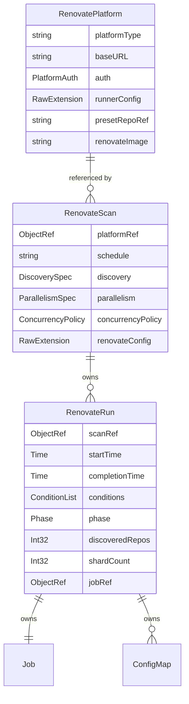

<!-- markdownlint-disable-file MD025 MD041 -->

# 0003. Multi-CRD architecture (Platform, Scan, Run)

<!--toc:start-->
- [Status](#status)
- [Context](#context)
- [Decision](#decision)
  - [Concern allocation](#concern-allocation)
  - [Default Scan via Helm](#default-scan-via-helm)
  - [Relationships](#relationships)
  - [What v0.1.0 ships](#what-v010-ships)
- [Consequences](#consequences)
  - [Positive](#positive)
  - [Negative](#negative)
  - [Neutral](#neutral)
- [Alternatives Considered](#alternatives-considered)
  - [A. Single CRD (the mogenius shape)](#a-single-crd-the-mogenius-shape)
  - [B. Two CRDs: Scan + Run](#b-two-crds-scan--run)
  - [C. Four CRDs: Platform + Config + Scan + Run](#c-four-crds-platform--config--scan--run)
  - [D. Cluster-scoped Scan, namespaced Platform](#d-cluster-scoped-scan-namespaced-platform)
- [References](#references)
<!--toc:end-->

## Status

Accepted — three CRDs scaffolded under `api/v1alpha1/`: `RenovatePlatform` (cluster-scoped, `rp`/`rplatform`), `RenovateScan` (namespaced, `rs`/`rscan`), `RenovateRun` (namespaced, `rr`/`rrun`). Status subresource on each. Spec/Status field shapes still placeholder (`Foo *string`); fields land in the next pass.

## Context

The reference implementation in this space, [`mogenius/renovate-operator`](https://github.com/mogenius/renovate-operator), uses a single `RenovateJob` CRD to model everything: Git platform credentials, schedule, parallelism budget, autodiscovery filter, pod scheduling rules, and per-project execution state. The result is a 1100+ line CRD schema with no clean RBAC story (one resource → one RBAC subject), per-instance credential duplication, and run history that lives as a mutating array in `.status` rather than as enumerable resources.

[RFC-0001](../rfc/0001-build-kubebuilder-renovate-operator.md) catalogs the consequences. This ADR records the architectural decision that follows.

The shape of the problem domain has three orthogonal concerns:

1. **Platform identity and credentials** — "this cluster talks to GitHub.com using this App ID and these private-key bytes." Owned by platform admins. Long-lived. Cluster-wide. Few instances per cluster.
2. **Scan policy** — "this team's repos should be Renovated nightly using this preset config." Owned by app teams. Long-lived. Namespaced. Many instances per cluster.
3. **Execution state** — "the run that started at 02:00 UTC is now in progress, has discovered N projects, and will be cleaned up after 7 days." Owned by the controller. Short-lived. Namespaced. Very many instances over time.

Conflating any two of these into one CRD breaks at least one of: RBAC, observability, history retention, or auditability.

## Decision

Model the domain with **three CRDs**, each owning exactly one of the three concerns above:

| Kind | Scope | Lifecycle | Owner | Counts |
|------|-------|-----------|-------|--------|
| `RenovatePlatform` | Cluster | Long-lived | Platform admin | O(platforms) per cluster |
| `RenovateScan` | Namespace | Long-lived | App team (or default-shipped via Helm) | O(teams) per cluster |
| `RenovateRun` | Namespace | Ephemeral (TTL) | Controller (owned by Scan) | O(scans × frequency × retention) |

### Concern allocation

Each concern lives on exactly one CRD:

| Concern | CRD | Rationale |
|---------|-----|-----------|
| Platform endpoint URL | `RenovatePlatform` | Per-platform, not per-scan |
| Auth (GitHub App, token) | `RenovatePlatform` | Cluster-scoped; one rotation point |
| Renovate runner config (`config.js` equivalent — `binarySource`, global `dryRun`, `onboarding`, etc.) | `RenovatePlatform` | Per-platform setting; consistent across scans on the same platform |
| Preset repo reference (`github>org/renovate-config`) | `RenovatePlatform` | Per-platform setting; the preset repo lives *on* the platform |
| Renovate image and tag | `RenovatePlatform` | Tied to which Renovate features the platform's runner config relies on |
| Schedule (cron) | `RenovateScan` | Per-scan policy |
| Discovery filter (`autodiscoverFilter`, `topics`, `requireConfig`) | `RenovateScan` | Per-scan policy |
| Parallelism bounds (`minPods`/`maxPods`/`reposPerPod`) | `RenovateScan` | Per-scan policy; different teams may want different parallelism |
| Concurrency policy (`Allow`/`Forbid`/`Replace`) | `RenovateScan` | Per-scan policy |
| Scan-level config overrides | `RenovateScan` | Layered on top of platform-level runner config |
| Per-execution state (started, completed, conditions, discovered repos, shard assignments, owned Job) | `RenovateRun` | Ephemeral runtime state |

The Scan's `spec.renovateConfig` is an optional `RawExtension` that **augments** the Platform's `runnerConfig` for that Scan's runs only — it is not a replacement. Merge precedence: `Scan.spec.renovateConfig` overrides `Platform.spec.runnerConfig` field-by-field.

### Default Scan via Helm

The Helm chart ships a `RenovateScan` named `default` enabled by default, with `requireConfig: true`. Users opt out via `defaultScan.enabled=false` in `values.yaml`. See [ADR-0008](0008-default-scan-via-helm-chart.md).

### Relationships

- A `RenovateScan` references exactly one `RenovatePlatform` by name (`spec.platformRef.name`). The reference is cluster-scoped because `RenovatePlatform` is cluster-scoped.
- A `RenovateRun` is created and owned by the `RenovateScan` controller. `metav1.OwnerReference` provides cascade delete; `ttlSecondsAfterFinished` on the owned Job and a separate retention policy on the Run handle history pruning.
- A `RenovateRun` owns exactly one Indexed `batch/v1.Job` plus one or two ConfigMaps (the discovered repo list, plus optionally a shard manifest). Job completion drives Run condition transitions via the controller's `Owns(&batchv1.Job{})` watch.

### What v0.1.0 ships

All three CRDs ship in v0.1.0. Run is not deferred — the parallelism story (the headline reason for this operator's existence) requires the Run abstraction from day one, since per-run state (discovered repo count, computed shard count, sharded Job reference) cannot reasonably live on Scan's status.

See [DESIGN-0001](../design/0001-renovate-operator-v0-1-0.md) for the full schemas.

## Consequences

### Positive

- **Clean RBAC split.** Platform admins get `*` on `renovateplatforms.renovate.fartlab.dev`, app teams get `*` on `renovatescans` in their namespace and read-only on `renovateruns`. Neither role can leak into the other.
- **Centralized credential management.** Token/secret rotation updates one `RenovatePlatform`; all referencing Scans pick up the new secret on the next pod create. No fan-out updates.
- **Run history is queryable.** `kubectl get renovaterun -n team-foo -l renovate.fartlab.dev/scan=nightly` returns enumerable resources. `kubectl describe renovaterun/<name>` shows conditions, owned Job, logs hint. No JSON-path expressions.
- **TTL and cascade delete come from k8s primitives.** `OwnerReferences` handle cascade delete on Scan deletion; `metav1.Time` + a TTL field handle history pruning. Standard machinery.
- **CRD schemas stay readable.** Each CRD's generated YAML is targeted at one concern, so `kubectl explain` output is useful and `kubectl edit` doesn't surface 1000 unrelated fields.
- **Versioning is independent.** `RenovateRun` can graduate to `v1beta1` without forcing `RenovatePlatform` to follow.

### Negative

- **Three CRDs to install.** More moving parts than a single-CRD design. Mitigated by Helm chart bundling all three.
- **Cross-resource references are validated softly.** A `RenovateScan` pointing at a non-existent `RenovatePlatform` is a soft error surfaced via conditions; the Scan stays `Ready=False/PlatformNotReady` until the reference resolves.
- **Cluster-scoped CRDs require cluster-admin to install.** Standard for any operator with global concerns; not unusual.

### Neutral

- The `RenovateRun` lifetime is short; we accept the storage cost of many small objects. etcd handles this fine for the scales we anticipate (homelab: hundreds of Runs total; enterprise: low millions over the cluster's lifetime — well within etcd's wheelhouse with TTL retention).

## Alternatives Considered

### A. Single CRD (the mogenius shape)

One `RenovateJob` for everything. Rejected for all the reasons in [RFC-0001 §"Why not mogenius/renovate-operator"](../rfc/0001-build-kubebuilder-renovate-operator.md#why-not-mogeniusrenovate-operator). The deciding factor is run-state-in-status: it makes audit, debugging, and history retention all worse than they need to be.

### B. Two CRDs: Scan + Run

Drop `RenovatePlatform`, embed credential refs directly in `RenovateScan`. Simpler. Loses the centralized-credential benefit; in the enterprise case, dozens of Scans pointing at the same GitHub org would each need their own `secretRef`. Loses the RBAC split between platform admins and app teams. **Rejected** because the credential-rotation story is bad enough at enterprise scale to justify the third CRD.

### C. Four CRDs: Platform + Config + Scan + Run

Add a separate `RenovateConfig` CRD for Renovate's preset config (`config:base`, custom managers, etc.) and runner-level config. Initially attractive because we already maintain a centralized `renovate-config` preset pattern. **Rejected** because there are two cleaner places for this content:

- **Runner-level config (`config.js` equivalent)** belongs on `RenovatePlatform`. It's per-platform — what `binarySource` to use, whether `onboarding` is on, what global hostRules apply — and is consistent across scans on the same platform. A separate CRD would just pull the same fields out of Platform without adding a useful boundary.
- **Per-repo Renovate config** belongs in the repos themselves (`renovate.json` in the repo's default branch), with shared presets via `extends:` chains pointing at a `presetRepoRef` already stored on Platform. Renovate's own preset/extends mechanism handles composition; the operator does not need its own composition layer.

If we ever do find a workflow that wants a CRD-shaped composition layer (e.g., multi-team configs that override Platform-level config without giving each team its own Scan), `RenovateConfig` is additive.

### D. Cluster-scoped Scan, namespaced Platform

Inverted scope. Loses RBAC split (Scans become a global concern), loses multi-tenancy. **Rejected** as a misread of who owns what.

## References

- [Kubernetes API conventions — resource scope](https://github.com/kubernetes/community/blob/master/contributors/devel/sig-architecture/api-conventions.md#resources)
- [`metav1.OwnerReference` and cascade delete](https://kubernetes.io/docs/concepts/architecture/garbage-collection/)
- [RFC-0001 §"Why not mogenius/renovate-operator"](../rfc/0001-build-kubebuilder-renovate-operator.md#why-not-mogeniusrenovate-operator)
- [ADR-0004: Use `metav1.Condition` and Run child resources for status](0004-use-conditions-and-run-children-for-status.md)
- [ADR-0005: Use Indexed Jobs for parallel Run workers](0005-indexed-jobs-for-parallelism.md)
- [ADR-0006: Multi-platform support](0006-multi-platform-support.md)
- [ADR-0008: Default `RenovateScan` shipped via Helm chart](0008-default-scan-via-helm-chart.md)
