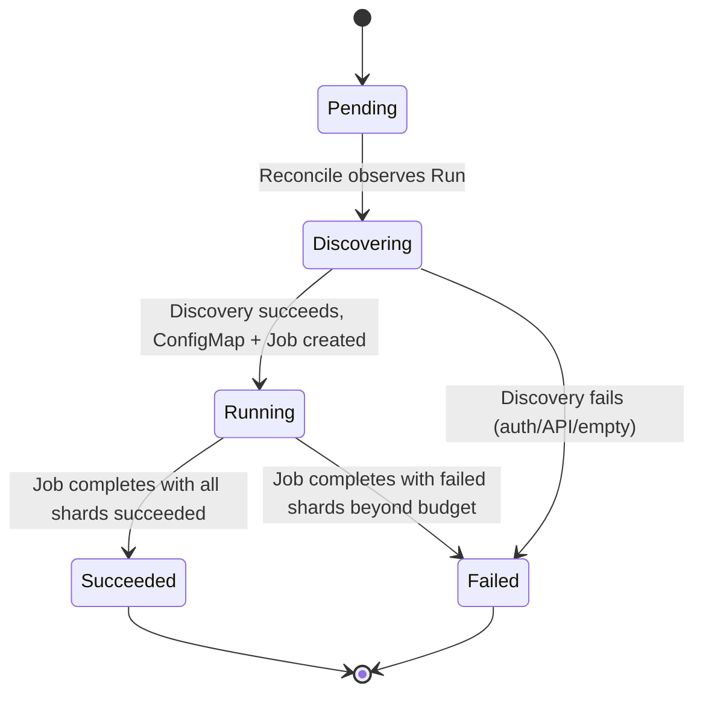

<!-- markdownlint-disable-file MD025 MD041 -->

# DESIGN 0001: renovate-operator v0.1.0

**Status:** Draft **Author:** donaldgifford **Date:** 2026-04-26

<!--toc:start-->
- [Overview](#overview)
- [Goals and Non-Goals](#goals-and-non-goals)
  - [Goals (v0.1.0)](#goals-v010)
  - [Non-Goals (v0.1.0)](#non-goals-v010)
- [Background](#background)
- [Detailed Design](#detailed-design)
  - [Project layout](#project-layout)
  - [API group and version](#api-group-and-version)
  - [Type definitions](#type-definitions)
    - [RenovatePlatform (cluster-scoped)](#renovateplatform-cluster-scoped)
    - [RenovateScan (namespace-scoped)](#renovatescan-namespace-scoped)
    - [RenovateRun (namespace-scoped, ephemeral)](#renovaterun-namespace-scoped-ephemeral)
    - [runnerConfig vs renovateConfigOverrides boundary](#runnerconfig-vs-renovateconfigoverrides-boundary)
  - [Reconciler: RenovatePlatform](#reconciler-renovateplatform)
  - [Reconciler: RenovateScan](#reconciler-renovatescan)
  - [Reconciler: RenovateRun](#reconciler-renovaterun)
    - [Phase: Pending](#phase-pending)
    - [Phase: Discovering](#phase-discovering)
    - [Phase: Running](#phase-running)
    - [Phase: Succeeded / Failed](#phase-succeeded--failed)
  - [Job builder (internal/controller/job_builder.go)](#job-builder-internalcontrollerjobbuildergo)
  - [Multi-platform authentication](#multi-platform-authentication)
    - [GitHub App](#github-app)
    - [Forgejo](#forgejo)
    - [Cross-namespace credentials](#cross-namespace-credentials)
  - [Discovery](#discovery)
    - [Rate limiting](#rate-limiting)
  - [Observability](#observability)
    - [Metrics](#metrics)
    - [Tracing](#tracing)
    - [Logging](#logging)
    - [Profiling](#profiling)
  - [Helm chart](#helm-chart)
    - [values.yaml (top-level surface)](#valuesyaml-top-level-surface)
  - [CI/CD](#cicd)
  - [Contrib directory](#contrib-directory)
- [Testing Strategy](#testing-strategy)
  - [Unit tests (*_test.go per package)](#unit-tests-testgo-per-package)
  - [Controller tests (envtest)](#controller-tests-envtest)
  - [kind-based e2e (test/e2e/)](#kind-based-e2e-teste2e)
  - [Lint and static analysis](#lint-and-static-analysis)
- [API / Interface Changes](#api--interface-changes)
- [Data Model](#data-model)
- [Migration / Rollout Plan](#migration--rollout-plan)
  - [v0.1.0 release sequence](#v010-release-sequence)
  - [Forward compatibility](#forward-compatibility)
- [Resolved Open Questions](#resolved-open-questions)
- [Future architecture: state DB](#future-architecture-state-db)
- [References](#references)
<!--toc:end-->

## Overview

Implementation blueprint for the first complete release of `renovate-operator`.
v0.1.0 ships everything required for the homelab Talos cluster and a credible
enterprise pilot: three CRDs, multi-platform support (GitHub App + Forgejo),
parallel workers via Indexed Jobs, full observability wiring, a `contrib/`
directory of dashboards and rules, and a CI pipeline that produces signed
multi-arch container images and an OCI-published Helm chart.

This document translates
[RFC-0001](../rfc/0001-build-kubebuilder-renovate-operator.md) and ADRs
[0001](../adr/0001-use-kubebuilder-for-operator-scaffolding.md)–[0008](../adr/0008-default-scan-via-helm-chart.md)
into Go types, reconciler logic, chart values, and a release process.

## Goals and Non-Goals

### Goals (v0.1.0)

- All three CRDs (`RenovatePlatform`, `RenovateScan`, `RenovateRun`) implemented
  and exercised end-to-end.
- Two platform types working: **GitHub via GitHub App** and **Forgejo via
  PAT/token**.
- Parallel worker execution via Indexed Jobs with
  `clamp(ceil(repos/reposPerWorker), minWorkers, maxWorkers)` sizing
  ([ADR-0005](../adr/0005-indexed-jobs-for-parallelism.md)).
- Default `RenovateScan` shipped via the Helm chart with `requireConfig: true`
  ([ADR-0008](../adr/0008-default-scan-via-helm-chart.md)).
- Standard `metav1.Condition`-based status, `observedGeneration`, printer
  columns
  ([ADR-0004](../adr/0004-use-conditions-and-run-children-for-status.md)).
- Full observability: Prometheus metrics, OTel tracing on hot paths, pprof
  endpoint, structured logs ([ADR-0007](../adr/0007-observability-stack.md)).
- `contrib/` tree with four Grafana dashboards (operator/runs/traces/logs),
  Prometheus alerts + recording rules, Alloy snippet.
- CI: lint, unit, envtest, kind-based e2e, multi-arch image build, cosign
  signing, Helm OCI push, semantic-release.
- Helm chart deployable to homelab Talos cluster; first real Renovate scan
  against `donaldgifford/server-price-tracker` and one Forgejo repo.

### Non-Goals (v0.1.0)

- Webhook-triggered runs (deferred to v0.2.0).
- Additional platforms beyond GitHub and Forgejo (GitLab, Bitbucket, ADO —
  deferred to v0.3.0).
- Built-in UI. `kubectl get renovaterun -A` + Grafana dashboards are sufficient.
- Mid-run worker rescaling (Indexed Job parallelism is fixed at Job creation).
- Conversion webhooks. v0.1.0 ships `v1alpha1` only; no compatibility promises
  until `v1beta1`.
- Per-Run profiling of the Renovate Node process. Operator-side pprof is in
  scope; worker-side is not.
- Multi-cluster fan-out. Multi-cluster patterns reach for ArgoCD ApplicationSets
  at the GitOps layer.

## Background

Renovate runs as a CLI: `renovate`, configured almost entirely through
environment variables (`RENOVATE_*`) and a JSON config (`RENOVATE_CONFIG` env or
mounted `config.js`). The CLI is shipped as a container image
(`ghcr.io/renovatebot/renovate:<tag>`). All operator-side work is about
scheduling that container, sharding the repo list across workers, injecting the
right env vars + secrets, and reflecting Job status into the CRDs.

Two key Renovate behaviors the operator depends on:

1. **`RENOVATE_REPOSITORIES`** — a JSON array constraining a Renovate run to a
   specific repo list. We use this to give each worker its shard.
2. **`RENOVATE_REQUIRE_CONFIG=required`** — instructs Renovate to skip repos
   lacking a Renovate config in their default branch. The operator passes this
   through whenever `Scan.spec.discovery.requireConfig: true`.

The operator does not parse Renovate's per-PR output, does not track per-repo PR
state, and does not maintain a discovery cache. Renovate handles its own state
via the platform (PRs are the source of truth).

## Detailed Design

### Project layout

Standard kubebuilder v4 layout, no surprises:

```
renovate-operator/
├── PROJECT
├── Makefile
├── Dockerfile
├── go.mod
├── cmd/
│   └── main.go
├── api/
│   └── v1alpha1/
│       ├── groupversion_info.go
│       ├── renovateplatform_types.go
│       ├── renovatescan_types.go
│       ├── renovaterun_types.go
│       ├── shared_types.go
│       └── zz_generated.deepcopy.go
├── internal/
│   ├── controller/
│   │   ├── renovateplatform_controller.go
│   │   ├── renovatescan_controller.go
│   │   ├── renovaterun_controller.go
│   │   ├── job_builder.go              // pure: Run + snapshots → Indexed Job spec
│   │   ├── shard_builder.go            // pure: repo list + WorkersSpec → ConfigMap data
│   │   └── suite_test.go
│   ├── platform/
│   │   ├── platform.go                 // Client interface
│   │   ├── github/
│   │   │   ├── client.go               // GitHub App / Apps API
│   │   │   └── discover.go             // Repo enumeration via REST + GraphQL search
│   │   └── forgejo/
│   │       ├── client.go               // Gitea-compatible client
│   │       └── discover.go
│   ├── observability/
│   │   ├── metrics.go                  // custom Prometheus collectors
│   │   ├── tracing.go                  // OTel SDK setup
│   │   └── pprof.go                    // pprof handler on :8082
│   └── credentials/
│       └── mirror.go                   // mirror Secret from operator ns to scan ns
├── config/                             // kubebuilder kustomize output
├── dist/
│   └── chart/                          // helm plugin output
├── contrib/
│   ├── grafana/dashboards/
│   ├── prometheus/
│   └── alloy/
├── test/
│   └── e2e/
└── docs/
```

### API group and version

- Group: `renovate.fartlab.dev` (placeholder; lock before tag).
- Version: `v1alpha1`.
- No compatibility guarantees until `v1beta1`.

### Type definitions

#### `RenovatePlatform` (cluster-scoped)

```go
// +kubebuilder:object:root=true
// +kubebuilder:resource:scope=Cluster,shortName=rp;rplatform
// +kubebuilder:subresource:status
// +kubebuilder:printcolumn:name="Type",type="string",JSONPath=".spec.platformType"
// +kubebuilder:printcolumn:name="URL",type="string",JSONPath=".spec.baseURL"
// +kubebuilder:printcolumn:name="Ready",type="string",JSONPath=`.status.conditions[?(@.type=="Ready")].status`
// +kubebuilder:printcolumn:name="Age",type="date",JSONPath=".metadata.creationTimestamp"
type RenovatePlatform struct {
    metav1.TypeMeta   `json:",inline"`
    metav1.ObjectMeta `json:"metadata,omitempty"`

    Spec   RenovatePlatformSpec   `json:"spec,omitempty"`
    Status RenovatePlatformStatus `json:"status,omitempty"`
}

type RenovatePlatformSpec struct {
    // PlatformType is the Renovate platform identifier.
    // +kubebuilder:validation:Enum=github;forgejo
    PlatformType PlatformType `json:"platformType"`

    // BaseURL is the platform API endpoint.
    // Defaults: github → https://api.github.com; forgejo → required (no default).
    // +optional
    BaseURL string `json:"baseURL,omitempty"`

    // Auth is the platform authentication configuration. Exactly one of githubApp or token must be set.
    Auth PlatformAuth `json:"auth"`

    // RunnerConfig is an opaque JSON blob passed to Renovate workers as RENOVATE_CONFIG.
    // Use for runner-level settings: binarySource, dryRun, hostRules, onboarding, etc.
    // +kubebuilder:pruning:PreserveUnknownFields
    // +optional
    RunnerConfig *runtime.RawExtension `json:"runnerConfig,omitempty"`

    // PresetRepoRef is the Renovate preset reference (e.g., "github>donaldgifford/renovate-config").
    // Workers receive this as an extends entry prepended to the repo's own renovate.json.
    // +optional
    PresetRepoRef string `json:"presetRepoRef,omitempty"`

    // RenovateImage is the container image used to run Renovate.
    // +kubebuilder:default="ghcr.io/renovatebot/renovate:latest"
    RenovateImage string `json:"renovateImage,omitempty"`
}

type PlatformAuth struct {
    // +optional
    GitHubApp *GitHubAppAuth `json:"githubApp,omitempty"`
    // +optional
    Token *TokenAuth `json:"token,omitempty"`
}

type GitHubAppAuth struct {
    // AppID is the GitHub App's numeric ID.
    AppID int64 `json:"appID"`

    // InstallationID scopes auth to a single installation. Required.
    // If the App is installed on multiple orgs, declare one RenovatePlatform per installation.
    InstallationID int64 `json:"installationID"`

    // PrivateKeyRef references a Secret containing the App's PEM private key.
    // Default key: "private-key.pem".
    PrivateKeyRef SecretKeyReference `json:"privateKeyRef"`
}

type TokenAuth struct {
    // SecretRef references a Secret containing the platform token.
    // Default key: "token".
    SecretRef SecretKeyReference `json:"secretRef"`
}

type SecretKeyReference struct {
    Name string `json:"name"`
    // +kubebuilder:default=token
    // +optional
    Key string `json:"key,omitempty"`
}

type RenovatePlatformStatus struct {
    // +listType=map
    // +listMapKey=type
    // +optional
    Conditions []metav1.Condition `json:"conditions,omitempty"`

    // +optional
    ObservedGeneration int64 `json:"observedGeneration,omitempty"`
}

type PlatformType string
const (
    PlatformTypeGitHub  PlatformType = "github"
    PlatformTypeForgejo PlatformType = "forgejo"
)
```

The `auth` discriminated union uses CEL validation (kubebuilder ≥ v4) to enforce
exactly-one-of:

```go
// +kubebuilder:validation:XValidation:rule="(has(self.githubApp) ? 1 : 0) + (has(self.token) ? 1 : 0) == 1",message="exactly one of githubApp or token must be set"
```

Combined with platform-type-specific rules (e.g., `forgejo` only allows
`token`):

```go
// On RenovatePlatformSpec:
// +kubebuilder:validation:XValidation:rule="self.platformType != 'forgejo' || has(self.auth.token)",message="forgejo platforms require token auth"
// +kubebuilder:validation:XValidation:rule="self.platformType != 'forgejo' || self.baseURL != ''",message="forgejo platforms require baseURL"
```

Credentials Secrets must live in the **operator's release namespace**. This is
documented and enforced by the Platform controller (the controller does not
search other namespaces for the secret).

#### `RenovateScan` (namespace-scoped)

```go
// +kubebuilder:object:root=true
// +kubebuilder:resource:shortName=rs;rscan
// +kubebuilder:subresource:status
// +kubebuilder:printcolumn:name="Platform",type="string",JSONPath=".spec.platformRef.name"
// +kubebuilder:printcolumn:name="Schedule",type="string",JSONPath=".spec.schedule"
// +kubebuilder:printcolumn:name="Last Run",type="date",JSONPath=".status.lastRunTime"
// +kubebuilder:printcolumn:name="Next Run",type="date",JSONPath=".status.nextRunTime"
// +kubebuilder:printcolumn:name="Ready",type="string",JSONPath=`.status.conditions[?(@.type=="Ready")].status`
// +kubebuilder:printcolumn:name="Age",type="date",JSONPath=".metadata.creationTimestamp"
type RenovateScanSpec struct {
    PlatformRef LocalObjectReference `json:"platformRef"`

    // Schedule is a cron expression evaluated in TimeZone.
    // +kubebuilder:validation:MinLength=1
    Schedule string `json:"schedule"`

    // +kubebuilder:default=UTC
    // +optional
    TimeZone string `json:"timeZone,omitempty"`

    // +kubebuilder:default=false
    // +optional
    Suspend bool `json:"suspend,omitempty"`

    // +kubebuilder:validation:Enum=Allow;Forbid;Replace
    // +kubebuilder:default=Forbid
    // +optional
    ConcurrencyPolicy ConcurrencyPolicy `json:"concurrencyPolicy,omitempty"`

    // Workers controls per-Run parallelism.
    // +optional
    Workers WorkersSpec `json:"workers,omitempty"`

    // Discovery configures repo enumeration.
    // +optional
    Discovery DiscoverySpec `json:"discovery,omitempty"`

    // RenovateConfigOverrides is layered on top of Platform.spec.runnerConfig.
    // +kubebuilder:pruning:PreserveUnknownFields
    // +optional
    RenovateConfigOverrides *runtime.RawExtension `json:"renovateConfigOverrides,omitempty"`

    // +optional
    ExtraEnv []corev1.EnvVar `json:"extraEnv,omitempty"`

    // +optional
    Resources *corev1.ResourceRequirements `json:"resources,omitempty"`

    // +kubebuilder:default=3
    // +optional
    SuccessfulRunsHistoryLimit *int32 `json:"successfulRunsHistoryLimit,omitempty"`

    // +kubebuilder:default=1
    // +optional
    FailedRunsHistoryLimit *int32 `json:"failedRunsHistoryLimit,omitempty"`
}

type WorkersSpec struct {
    // +kubebuilder:default=1
    // +kubebuilder:validation:Minimum=1
    MinWorkers int32 `json:"minWorkers,omitempty"`

    // +kubebuilder:default=10
    // +kubebuilder:validation:Minimum=1
    MaxWorkers int32 `json:"maxWorkers,omitempty"`

    // +kubebuilder:default=50
    // +kubebuilder:validation:Minimum=1
    ReposPerWorker int32 `json:"reposPerWorker,omitempty"`

    // +kubebuilder:default=2
    // +kubebuilder:validation:Minimum=0
    BackoffLimitPerIndex *int32 `json:"backoffLimitPerIndex,omitempty"`
}

type DiscoverySpec struct {
    // Autodiscover enables platform-side repo enumeration.
    // +kubebuilder:default=true
    // +optional
    Autodiscover bool `json:"autodiscover,omitempty"`

    // RequireConfig skips repos lacking a Renovate config in their default branch.
    // STRONGLY recommended for org-wide scans to avoid mass onboarding-PR generation.
    // +kubebuilder:default=true
    // +optional
    RequireConfig bool `json:"requireConfig,omitempty"`

    // Filter is a list of Renovate-style autodiscover filters (e.g., "owner/*", "owner/prefix-*").
    // Empty = no filter (all repos accessible to the credentials).
    // +optional
    Filter []string `json:"filter,omitempty"`

    // Topics restricts to repos with at least one of the listed topics (GitHub only).
    // +optional
    Topics []string `json:"topics,omitempty"`

    // +kubebuilder:default=true
    // +optional
    SkipForks bool `json:"skipForks,omitempty"`

    // +kubebuilder:default=true
    // +optional
    SkipArchived bool `json:"skipArchived,omitempty"`
}

type RenovateScanStatus struct {
    // +listType=map
    // +listMapKey=type
    // +optional
    Conditions []metav1.Condition `json:"conditions,omitempty"`

    // +optional
    LastRunTime *metav1.Time `json:"lastRunTime,omitempty"`

    // +optional
    LastSuccessfulRunTime *metav1.Time `json:"lastSuccessfulRunTime,omitempty"`

    // +optional
    NextRunTime *metav1.Time `json:"nextRunTime,omitempty"`

    // +optional
    LastRunRef *corev1.ObjectReference `json:"lastRunRef,omitempty"`

    // +optional
    ActiveRuns []corev1.ObjectReference `json:"activeRuns,omitempty"`

    // +optional
    ObservedGeneration int64 `json:"observedGeneration,omitempty"`
}
```

Field shape consciously borrows from `batch/v1.CronJob` (`schedule`, `suspend`,
`concurrencyPolicy`, `*HistoryLimit`, `timeZone`).

#### `RenovateRun` (namespace-scoped, ephemeral)

```go
// +kubebuilder:object:root=true
// +kubebuilder:resource:shortName=rr;rrun
// +kubebuilder:subresource:status
// +kubebuilder:printcolumn:name="Scan",type="string",JSONPath=".spec.scanRef.name"
// +kubebuilder:printcolumn:name="Phase",type="string",JSONPath=".status.phase"
// +kubebuilder:printcolumn:name="Repos",type="integer",JSONPath=".status.discoveredRepos"
// +kubebuilder:printcolumn:name="Workers",type="integer",JSONPath=".status.actualWorkers"
// +kubebuilder:printcolumn:name="Started",type="date",JSONPath=".status.startTime"
// +kubebuilder:printcolumn:name="Completed",type="date",JSONPath=".status.completionTime"

type RenovateRunSpec struct {
    // ScanRef points at the parent Scan. Set automatically; do not edit.
    ScanRef LocalObjectReference `json:"scanRef"`

    // PlatformSnapshot captures the Platform spec at Run creation. Frozen for the lifetime of the Run.
    PlatformSnapshot RenovatePlatformSpec `json:"platformSnapshot"`

    // ScanSnapshot captures the Scan spec at Run creation. Frozen for the lifetime of the Run.
    ScanSnapshot RenovateScanSpec `json:"scanSnapshot"`
}

type RenovateRunStatus struct {
    // +listType=map
    // +listMapKey=type
    // +optional
    Conditions []metav1.Condition `json:"conditions,omitempty"`

    // +kubebuilder:validation:Enum=Pending;Discovering;Running;Succeeded;Failed
    // +optional
    Phase RunPhase `json:"phase,omitempty"`

    // +optional
    StartTime *metav1.Time `json:"startTime,omitempty"`
    // +optional
    DiscoveryCompletionTime *metav1.Time `json:"discoveryCompletionTime,omitempty"`
    // +optional
    WorkersStartTime *metav1.Time `json:"workersStartTime,omitempty"`
    // +optional
    CompletionTime *metav1.Time `json:"completionTime,omitempty"`

    // +optional
    DiscoveredRepos int32 `json:"discoveredRepos,omitempty"`
    // +optional
    ActualWorkers int32 `json:"actualWorkers,omitempty"`

    // +optional
    ShardConfigMapRef *corev1.ObjectReference `json:"shardConfigMapRef,omitempty"`
    // +optional
    WorkerJobRef *corev1.ObjectReference `json:"workerJobRef,omitempty"`

    // +optional
    SucceededShards int32 `json:"succeededShards,omitempty"`
    // +optional
    FailedShards int32 `json:"failedShards,omitempty"`

    // +optional
    ObservedGeneration int64 `json:"observedGeneration,omitempty"`
}

type RunPhase string
const (
    RunPhasePending     RunPhase = "Pending"
    RunPhaseDiscovering RunPhase = "Discovering"
    RunPhaseRunning     RunPhase = "Running"
    RunPhaseSucceeded   RunPhase = "Succeeded"
    RunPhaseFailed      RunPhase = "Failed"
)
```

Snapshots are critical: a Run's behavior cannot change because someone edited
the parent Scan or Platform mid-run. The snapshot is set once at Run creation
and never updated.

#### `runnerConfig` vs `renovateConfigOverrides` boundary

Both fields end up merged into `RENOVATE_CONFIG` for worker pods. To avoid
silent shadowing, treat them as three disjoint zones:

- **Operator-managed** (do **not** set in either field; ignored if present):
  `platform`, `endpoint`, `repositories`, `autodiscover`, `requireConfig`,
  `token`, `githubAppID`, `githubAppKey`. The operator derives these from the
  Platform and Scan specs.
- **`Platform.spec.runnerConfig`** (org-wide defaults; rarely changed):
  `binarySource`, `hostRules`, `onboarding`, `onboardingConfig`, `dryRun`
  default, `gitAuthor`, network/proxy settings.
- **`Scan.spec.renovateConfigOverrides`** (per-Scan tuning):
  `extends`, `packageRules`, `branchPrefix`, `prHourlyLimit`,
  `prConcurrentLimit`, `dryRun` override, schedule-window settings.

Merge precedence (later wins): `runnerConfig` → `renovateConfigOverrides` →
operator-managed (operator-managed always wins).

### Reconciler: `RenovatePlatform`

Per reconcile:

1. Fetch the Platform.
2. Resolve credentials based on `spec.auth`:
   - **GitHubApp**: read PEM Secret in operator ns; parse RSA private key; mint
     a JWT; verify against GitHub's `/app` endpoint (light health check).
   - **Token**: read token Secret in operator ns; verify non-empty.
3. Set `Ready=True/False` with
   `Reason ∈ {CredentialsResolved, SecretNotFound, KeyMissing, AuthFailed, PlatformUnreachable}`.
4. Record `observedGeneration = obj.Generation`.
5. No `RequeueAfter`; reconcile only on changes via informer.

Watches: `RenovatePlatform` + `Secret` (mapped to Platforms whose
`auth.{githubApp,token}.*Ref.name` matches).

### Reconciler: `RenovateScan`

Per reconcile:

1. Fetch the Scan.
2. If `spec.suspend`: set `Scheduled=False / Reason=Suspended`; compute `Ready`
   from Platform validity; return.
3. Resolve `spec.platformRef` to a Platform. If missing or `Ready=False`: set
   `Ready=False / Reason=PlatformNotReady`; `RequeueAfter=60s`.
4. Parse `spec.schedule` against `spec.timeZone`. If invalid:
   `Ready=False / Reason=InvalidSchedule`; no requeue.
5. List child Runs owned by this Scan.
6. Apply `concurrencyPolicy` against active (non-terminal) Runs:
   - **Forbid**: if any active Run, set `Reason=ActiveRun`, requeue at next fire
     time, do not create.
   - **Allow**: always create at fire time.
   - **Replace**: if any active Run, set its parent Run's
     `spec.cancelRequested=true` (a no-op v0.1.0; the Run controller will pick
     this up in v0.2.0; for now equivalent to Forbid + log a warning).
7. Compute `nextRunTime` from cron + tz.
8. If `now >= nextRunTime`: create a `RenovateRun` (snapshotting Platform + Scan
   specs into `spec.platformSnapshot` and `spec.scanSnapshot`); update
   `lastRunTime`, `lastRunRef`.
9. GC old Runs per `*HistoryLimit`.
10. Set `Ready=True`, `Scheduled=True`. `RequeueAfter = nextRunTime - now`,
    capped at 5 minutes.

Watches: `RenovateScan` + `RenovatePlatform` (mapped) + `RenovateRun` (owned).

### Reconciler: `RenovateRun`

The interesting one. Two-phase state machine: **Discovering → Running →
Succeeded/Failed**.



Per reconcile:

1. Fetch the Run.
2. Switch on `status.phase`:

#### Phase: Pending

- Set `phase=Discovering`, `startTime=now`, condition `Started=True`.
- Construct platform client from `spec.platformSnapshot.auth`.
- Mirror the credential Secret from operator ns → Run ns (creates `Secret` named
  `renovate-creds-<run-name>`, owner-ref to Run).
- Call `platform.Discover(ctx, spec.scanSnapshot.discovery)` — returns
  `[]string` of `org/repo`.
- Apply `requireConfig` filter: for each candidate repo, query the platform for
  the existence of a known config file (`renovate.json`, `.renovaterc`,
  `.renovaterc.json`, `.github/renovate.json`, `.gitlab/renovate.json` for
  Forgejo). Concurrency-bounded with `errgroup.SetLimit(50)` — discovery should
  not become a self-DoS.
- If `len(repos) == 0`: set `phase=Failed`, condition
  `Failed=True / Reason=NoRepos`. Done.
- Compute
  `actualWorkers = clamp(ceil(len(repos)/scanSnapshot.workers.reposPerWorker), minWorkers, maxWorkers)`.
- Build shard ConfigMap: round-robin assign repos to N shards; key per-shard as
  `shard-NNNN.json`; gzip+base64 if total size exceeds 900 KiB (etcd safety
  margin).
- Create the ConfigMap (owner-ref to Run); set `status.shardConfigMapRef`,
  `discoveredRepos`, `actualWorkers`, `discoveryCompletionTime`.
- Build the Indexed Job (`internal/controller/job_builder.go`); create it
  (owner-ref to Run); set `status.workerJobRef`, `workersStartTime`.
- Set `phase=Running`, condition `Discovered=True`.
- Requeue with no delay (will be triggered by Job watch).

#### Phase: Discovering

- Re-entered if the controller crashed mid-Pending. Re-execute the Pending steps
  idempotently:
  - ConfigMap exists and is correctly labeled? Skip rebuilding.
  - Worker Job exists? Skip rebuilding.
- Otherwise resume.

#### Phase: Running

- Fetch the owned Worker Job by `workerJobRef`.
- Read
  `job.status.{succeeded, failed, active, completedIndexes, failedIndexes}`.
- Update `status.{succeededShards, failedShards}`.
- If Job is complete (`succeeded == completions`): `phase=Succeeded`,
  `completionTime=now`, condition `Succeeded=True`.
- If Job has terminal failure (per `backoffLimitPerIndex` exhaustion + ≥ 1
  failed index OR explicit `JobFailed`): `phase=Failed`, condition
  `Failed=True / Reason=WorkerShardFailed`.
- Otherwise: requeue (next reconcile from Job watch).

#### Phase: Succeeded / Failed

- Terminal. No further reconcile work. Run will be GC'd by the parent Scan
  controller's history limits.

Watches: `RenovateRun` + `Job` (owned, via `Owns(&batchv1.Job{})`) + `ConfigMap`
(owned).

### Job builder (`internal/controller/job_builder.go`)

Pure function, no client calls, fully unit-testable:

```go
func BuildWorkerJob(run *v1alpha1.RenovateRun, configMap *corev1.ConfigMap) *batchv1.Job
```

Salient details:

- Job name: `<run-name>-worker` truncated to RFC 1123 limits.
- Labels: `renovate.fartlab.dev/{run, scan, platform}=<n>`,
  `app.kubernetes.io/managed-by=renovate-operator`,
  `app.kubernetes.io/component=worker`.
- Owner ref: `RenovateRun` with `Controller=true`, `BlockOwnerDeletion=true`.
- Job spec:
  - `completionMode: Indexed`
  - `parallelism: actualWorkers`
  - `completions: actualWorkers`
  - `backoffLimit: 0` (we use `backoffLimitPerIndex`)
  - `backoffLimitPerIndex: scanSnapshot.workers.backoffLimitPerIndex`
  - `podFailurePolicy`: terminate the Job only on egregious failures (image pull
    errors); per-index retries handle transient.
  - `ttlSecondsAfterFinished: 604800` (7 days).
- Pod spec:
  - `restartPolicy: Never`.
  - Single container `renovate` from `platformSnapshot.renovateImage`.
  - **Env vars** assembled in order (later wins on conflict):
    1. Platform-derived: `RENOVATE_PLATFORM`, `RENOVATE_ENDPOINT` (if
       `baseURL`), `LOG_LEVEL=info`, `LOG_FORMAT=json`.
    2. Auth: see
       [Multi-platform authentication](#multi-platform-authentication).
    3. Discovery: `RENOVATE_AUTODISCOVER=false` (the operator did discovery —
       workers receive the explicit list), `RENOVATE_REQUIRE_CONFIG=required` if
       Scan has `requireConfig: true`.
    4. Repo list: `RENOVATE_REPOSITORIES` populated from the shard at
       `JOB_COMPLETION_INDEX` via an init step (see below).
    5. `RENOVATE_CONFIG`: JSON merge of `platformSnapshot.runnerConfig` +
       `scanSnapshot.renovateConfigOverrides` (later overrides). `extends` array
       prepended with `presetRepoRef` if set.
    6. Trace propagation: `OTEL_EXPORTER_OTLP_ENDPOINT`,
       `OTEL_SERVICE_NAME=renovate-worker`, `traceparent` (current span
       context).
    7. `scanSnapshot.extraEnv` last.
- Init container `shard-loader`: small busybox-equivalent reads
  `/etc/shards/shard-${JOB_COMPLETION_INDEX}.json`, decodes if gzipped, exports
  `RENOVATE_REPOSITORIES` to a shared `emptyDir` env file. Main container
  sources via shell entrypoint (`exec /usr/local/sbin/renovate-entrypoint`).
- Volume: ConfigMap mounted at `/etc/shards`.
- Resource requests/limits from `scanSnapshot.resources`.

### Multi-platform authentication

Auth flows differ per platform but converge on the same Renovate env-var
contract:

#### GitHub App

Operator-side:

- Read PEM private key from `auth.githubApp.privateKeyRef.name` (operator ns).
- Mint installation tokens lazily as workers are dispatched, **OR** pass the App
  ID + PEM through to Renovate and let Renovate handle JWT minting itself.

Decision: **pass-through**. Renovate's CLI handles GitHub App auth natively via:

```
RENOVATE_GITHUB_APP_ID=<id>
RENOVATE_GITHUB_APP_KEY=<pem-content>
```

No JWT-minting code in the operator. The operator mounts the PEM as a Secret and
references it from the worker pod's env. The PEM material is mirrored from the
operator ns to the Scan ns (see
[Cross-namespace credentials](#cross-namespace-credentials)).

The operator does mint JWTs **for its own discovery API calls**, since discovery
happens inside the controller and we don't want to shell out to `renovate` just
to enumerate repos. Discovery uses `github.com/bradleyfalzon/ghinstallation/v2`
for the JWT + installation token flow.

#### Forgejo

Pass `RENOVATE_TOKEN` to Renovate workers; the operator uses the same token for
discovery via the Gitea-compatible REST API. Renovate platform string is `gitea`
(Forgejo's API-compatibility lineage).

```
RENOVATE_PLATFORM=gitea
RENOVATE_ENDPOINT=https://forge.fartlab.dev/api/v1
RENOVATE_TOKEN=<token>
```

#### Cross-namespace credentials

Worker Jobs run in the Scan's namespace, but credential Secrets live in the
operator's release namespace. v0.1.0 resolves this by **mirroring** the Secret
into the Scan's namespace at Run start:

- Secret name: `renovate-creds-<run-name>`.
- Owner ref: the `RenovateRun` (cascade delete at Run end).
- Labels: `renovate.fartlab.dev/managed=true`.
- Contents: a copy of the credential Secret from the operator namespace.

The operator does **not** itself talk to any external secret backend. How the
credential Secret arrives in the operator namespace is a deployment concern:

- **Homelab**: `onepassword-connect` operator syncs from a 1Password vault into
  the operator namespace.
- **Production**: External Secrets Operator (ESO) with a `ClusterSecretStore`
  populates the operator namespace.

**Security caveat (documented):** users with `get`/`list` on `Secret` in a
Scan's namespace can read the platform credentials during the lifetime of any
Run in that namespace. Acceptable for single-tenant deployments; multi-tenant
isolation is a v0.2.0+ topic (likely a per-Scan `ExternalSecret` provisioned
in the Scan namespace, bypassing the mirror entirely).

### Discovery

`internal/platform/platform.go` defines:

```go
type Client interface {
    Discover(ctx context.Context, filter DiscoveryFilter) ([]Repository, error)
    HasRenovateConfig(ctx context.Context, repo Repository) (bool, error)
}

type Repository struct {
    Slug          string  // "org/name"
    DefaultBranch string
    Archived      bool
    Fork          bool
    Topics        []string
}

type DiscoveryFilter struct {
    Patterns     []string  // Renovate-style: "org/*", "org/prefix-*"
    Topics       []string
    SkipForks    bool
    SkipArchived bool
}
```

Implementations:

- **`internal/platform/github`**: uses `go-github/v62` with `ghinstallation` for
  App auth or PAT for token auth. Discovery uses the Search API
  (`GET /search/repositories?q=org:foo`) for filter + topics; falls back to
  `/orgs/{org}/repos` paginated. `HasRenovateConfig` uses
  `GET /repos/{org}/{repo}/contents/{path}` for each candidate path; first 200
  wins.
- **`internal/platform/forgejo`**: uses `code.gitea.io/sdk/gitea`. Discovery via
  `/orgs/{org}/repos` paginated. `HasRenovateConfig` via
  `/repos/{owner}/{repo}/contents/{filepath}`.

`HasRenovateConfig` checks paths in order: `renovate.json`, `.renovaterc`,
`.renovaterc.json`, `.github/renovate.json`, `.gitlab/renovate.json`. Result
cached in-memory per Run (we don't recheck for the same repo within one
discovery pass).

#### Rate limiting

GitHub App primary rate limit is 5,000 req/hr per installation (15,000 GHEC);
discovery with `requireConfig: true` does up to 5 contents-API calls per
candidate, so an org with 1k repos costs 5k requests — one full hour budget.
v0.1.0 ships an in-process per-installation token-bucket limiter (sized
conservatively, with retry-after handling on secondary limits) shared across
the discovery `errgroup`. This is sufficient for the homelab scale and a
single-installation enterprise pilot.

Cross-Run / cross-Scan rate budgeting (e.g., "spread Scans across the hour to
fit the App's hourly quota") is **deferred** — it requires shared state
across reconciles and across operator restarts. See
[Future architecture: state DB](#future-architecture-state-db).

### Observability

#### Metrics

Already enumerated in [ADR-0007](../adr/0007-observability-stack.md).
Implemented in `internal/observability/metrics.go` using
`prometheus/client_golang`. Custom collectors registered with
controller-runtime's metrics registry; exposed at `:8080/metrics` alongside
controller-runtime's defaults.

Metric registration:

```go
var (
    runsTotal = prometheus.NewCounterVec(
        prometheus.CounterOpts{Name: "renovate_operator_runs_total"},
        []string{"scan", "platform", "result"},
    )
    runDurationSeconds = prometheus.NewHistogramVec(
        prometheus.HistogramOpts{
            Name:    "renovate_operator_run_duration_seconds",
            Buckets: prometheus.ExponentialBuckets(60, 2, 10), // 1m → ~17h
        },
        []string{"scan", "platform"},
    )
    // ... others
)

func init() {
    metrics.Registry.MustRegister(runsTotal, runDurationSeconds, /* ... */)
}
```

#### Tracing

Setup in `internal/observability/tracing.go`. SDK config from env (`OTEL_*`);
no-op tracer when unset:

```go
func InitTracer(ctx context.Context, serviceVersion string) (func(context.Context) error, error) {
    if os.Getenv("OTEL_EXPORTER_OTLP_ENDPOINT") == "" {
        return func(context.Context) error { return nil }, nil
    }
    // ... otlptracegrpc.New + sdktrace.NewTracerProvider + otel.SetTracerProvider
}
```

logr ↔ trace bridge: a custom `logr.LogSink` reads the active span from the
reconcile context and adds `trace_id` / `span_id` keys to every log line.

#### Logging

Default kubebuilder zap setup, with one tweak: structured fields `trace_id` and
`span_id` injected via the bridge above.

#### Profiling

`internal/observability/pprof.go` registers `net/http/pprof` handlers on `:8082`
behind the `--pprof-bind-address` flag. Disabled by default in chart values for
production; enabled in dev values.

### Helm chart

The chart is generated by the kubebuilder Helm plugin at `dist/chart/`. We
extend it with hand-edits in `dist/chart/templates/extra/` for things the
generator doesn't cover (default `RenovateScan`, `ServiceMonitor`,
`PrometheusRule` references).

**Deployment prerequisites** (not bundled by the chart):

- **cert-manager** is required for any future webhook-bearing release. v0.1.0
  ships no webhooks, so cert-manager is *recommended* but not strictly
  required; the kubebuilder-scaffolded `dist/chart/templates/certmanager/`
  directory is stripped from v0.1.0 charts.
- **Prometheus Operator** with kube-prometheus-stack defaults — the chart's
  `metrics.serviceMonitor.additionalLabels` and
  `metrics.prometheusRule.additionalLabels` default to
  `{release: kube-prometheus-stack}` so resources are picked up
  out-of-the-box. Override via Helm values for non-default Operator setups.
- **Credential delivery** — 1Password Connect Operator (homelab) or External
  Secrets Operator (production), populating the credential Secret in the
  operator's release namespace.

#### values.yaml (top-level surface)

```yaml
image:
  repository: ghcr.io/donaldgifford/renovate-operator
  tag: "" # defaults to chart appVersion
  pullPolicy: IfNotPresent

replicaCount: 1 # > 1 enables leader election
leaderElect: true

resources:
  requests:
    cpu: 100m
    memory: 128Mi
  limits:
    cpu: 500m
    memory: 512Mi

# Observability
metrics:
  enabled: true
  port: 8080
  serviceMonitor:
    enabled: false # requires Prometheus Operator
    interval: 30s
    additionalLabels: {}
  prometheusRule:
    enabled: false
    additionalLabels: {}

tracing:
  enabled: false
  otlpEndpoint: "" # e.g., "alloy.observability.svc:4317"
  serviceName: renovate-operator
  resourceAttributes: {}

pprof:
  enabled: false
  port: 8082

logging:
  level: info # error|warn|info|debug
  format: json # json|console

# Default Scan (see ADR-0008)
defaultScan:
  enabled: true
  name: default
  namespace: "" # defaults to release namespace
  platformRef:
    name: "" # required if enabled

  schedule: "0 4 * * 0"
  timeZone: UTC
  suspend: false
  concurrencyPolicy: Forbid

  workers:
    minWorkers: 1
    maxWorkers: 10
    reposPerWorker: 50
    backoffLimitPerIndex: 2

  discovery:
    autodiscover: true
    requireConfig: true
    filter: []
    topics: []
    skipForks: true
    skipArchived: true

  successfulRunsHistoryLimit: 3
  failedRunsHistoryLimit: 1

  resources:
    requests:
      cpu: 250m
      memory: 512Mi
    limits:
      cpu: 2000m
      memory: 4Gi

  extraEnv: []

# Platform configuration is NOT in values.yaml.
# Users apply RenovatePlatform manifests separately so credentials never live in Helm values.
```

Pre-install validation hook: a small ConfigMap render-template lint that fails
if `defaultScan.enabled=true && defaultScan.platformRef.name == ""`.

### CI/CD

GitHub Actions workflows in `.github/workflows/`:

| Workflow                                | Trigger           | Steps                                                                                                                                                                                                                                                                                                 |
| --------------------------------------- | ----------------- | ----------------------------------------------------------------------------------------------------------------------------------------------------------------------------------------------------------------------------------------------------------------------------------------------------- |
| `ci.yaml`                               | PR, push to main  | golangci-lint → `make manifests generate helm` (drift check) → `go test ./...` (unit) → envtest → kind e2e                                                                                                                                                                                            |
| `release.yaml`                          | Tag push (`v*`)   | Build multi-arch image (linux/amd64, linux/arm64) via `docker buildx bake` (config in `docker-bake.hcl`) → push to `ghcr.io/donaldgifford/renovate-operator` → cosign sign → SBOM (syft) → Helm chart push to `oci://ghcr.io/donaldgifford/renovate-operator/charts` → `make build-installer` → attach plain manifests to GitHub release |
| `nightly.yaml`                          | Cron 03:00 UTC    | Same as ci, but with extended e2e: full discovery against a live Forgejo sandbox + GitHub stub                                                                                                                                                                                                        |
| `dependabot.yaml` (Renovate, of course) | Renovate webhooks | Dogfooding — operator's own deps managed by the operator running in homelab                                                                                                                                                                                                                           |

Release process: semantic-release on `main`, conventional-commit-driven version
bumps. CHANGELOG generated. Tags trigger the release workflow.

Dockerfile: kubebuilder default (multi-stage, distroless final, non-root,
read-only rootfs). One change: add a `pprof` build tag so we can produce both
pprof-enabled and stripped binaries.

### Contrib directory

```
contrib/
├── README.md                     # Index + import instructions
├── grafana/
│   ├── dashboards/
│   │   ├── operator.json         # controller health: reconcile rates, errors, workqueue
│   │   ├── runs.json             # per-Run lifecycle: discovery time, workers, repo throughput
│   │   ├── traces.json           # OTel trace explorer (Tempo data source)
│   │   └── logs.json             # Loki log explorer with Run/Scan filter variables
│   └── README.md
├── prometheus/
│   ├── alerts.yaml               # PrometheusRule with alerts (see ADR-0007)
│   ├── recording-rules.yaml      # Pre-aggregations for dashboard performance
│   └── README.md
└── alloy/
    ├── operator.river            # Alloy config: scrape :8080, forward operator+worker logs to Loki, OTLP receiver
    └── README.md
```

The dashboards are versioned alongside the operator. CI lint enforces that every
metric defined in `internal/observability/metrics.go` is referenced in at least
one dashboard panel or alert (or excluded via `// metric:internal`).

## Testing Strategy

### Unit tests (`*_test.go` per package)

- `internal/controller/job_builder.go` — exhaustive table-driven: env var
  assembly, label/annotation correctness, owner refs, indexed-Job spec
  correctness, resource overrides.
- `internal/controller/shard_builder.go` — sharding correctness for various
  N/repo-count combinations; ConfigMap data correctness; gzip path triggered
  above threshold.
- `internal/platform/{github,forgejo}` — recorded HTTP fixtures via
  `dnaeon/go-vcr`; covers happy path, pagination, rate-limit retry, 404, auth
  failure.
- Cron parsing helpers — DST transition correctness with `spec.timeZone`.

### Controller tests (envtest)

In `internal/controller/suite_test.go` + per-controller test files:

- Platform: missing Secret → `Ready=False/SecretNotFound`; valid Secret →
  `Ready=True`.
- Scan: missing Platform → `Ready=False/PlatformNotReady`; malformed cron →
  `Ready=False/InvalidSchedule`; happy path → spawns Run at fire time.
- Run: full state machine through `Pending → Discovering → Running → Succeeded`.
  Uses a stub platform client (registered via interface, not network).
- Concurrency policies under three scenarios × policy matrix.
- Cascade deletion: delete Scan → all Runs garbage-collected.

### kind-based e2e (`test/e2e/`)

A small set of end-to-end tests, runnable via `make e2e`:

1. **GitHub-PAT-stub e2e**: deploys the operator, applies a `RenovatePlatform`
   pointing at a containerized GitHub-API stub (`mock-github` or recorded VCR),
   applies a `RenovateScan` with `schedule: */1 * * * *`, waits for
   `Run.status.phase=Succeeded`, asserts metrics increment, asserts log line for
   the Run is present.
2. **Forgejo e2e**: same shape but with a real Forgejo instance running in the
   kind cluster (Forgejo's image is small enough to ship in CI).
3. **Parallelism e2e**: 200 stub repos, `maxWorkers: 5`, `reposPerWorker: 50` →
   assert `actualWorkers == 4`, all 200 repos appear in shard ConfigMap, Job's
   `parallelism == 4`.

Stub-vs-real choice for GitHub deferred to spike; v0.1.0 ships with stub for CI
speed and a separate manual e2e against `donaldgifford/server-price-tracker`
documented in `test/manual/README.md`.

### Lint and static analysis

- `golangci-lint` (config in repo).
- `make manifests` and `make generate` produce no diff in CI.
- `make helm` produces no diff in CI.
- Custom lint: every metric defined in code appears in a dashboard or alert (or
  has `// metric:internal`).

## API / Interface Changes

This is a new project. No existing interface to break.

User-facing CLI: `kubectl` only. No custom CLI in v0.1.0.

## Data Model

Already covered in the type definitions above. No external storage; everything
in etcd via standard CRD storage.

Two ConfigMap shapes used by the operator:

- **Shard ConfigMap** (per-Run, owned by Run): `shard-NNNN.json` keys +
  `manifest.json`. May be gzipped+base64 if total size > 900 KiB.
- **Mirrored credential Secret** (per-Run, owned by Run): copy of the platform
  credential Secret, scoped to the Run's lifetime.

## Migration / Rollout Plan

### v0.1.0 release sequence

1. All envtest + unit tests + e2e green.
2. RFC-0001 status → Accepted; ADRs 0001–0008 → Accepted.
3. Tag `v0.1.0` on `main`.
4. CI builds + signs + pushes image and chart.
5. Manual deploy to homelab Talos: apply `RenovatePlatform` for `github.com`
   (App auth), apply chart with
   `defaultScan.enabled=true, defaultScan.platformRef.name=github`. Verify a
   real Renovate PR opens against `donaldgifford/server-price-tracker`.
6. Repeat for Forgejo platform against the homelab Forgejo instance.
7. Announce in README; tag for any external interest.

### Forward compatibility

CRDs are `v1alpha1`. We document explicitly: no compatibility promises until
`v1beta1`. Field renames or removals will result in a CRD version bump and a
manual migration step. Users adopting v0.1.0 understand they're on the cutting
edge.

## Resolved Open Questions

- **API group name** — Locked: `renovate.fartlab.dev`.
- **Discovery testing strategy** — `go-vcr` recordings for unit-level platform
  tests; real Forgejo container for the Forgejo e2e; VCR for the GitHub e2e in
  v0.1.0. Revisit a live mock server only if VCR fixture rot becomes painful.
- **Worker entrypoint** — Locked: inline shell script for v0.1.0. Cutover to a
  sidecar image only when the script needs platform-specific branching or its
  own tests.
- **Credential delivery** — Operator continues to consume an in-namespace
  Secret and mirror it per Run. How that Secret arrives is a deployment
  concern: 1Password Connect (homelab), ESO (production). The mirror behavior
  is unchanged from v0.1.0; multi-tenant isolation is a v0.2.0+ topic.
- **Renovate image pin** — Ship `:latest` through v0.1.0 stabilization; pin to
  a specific Renovate version (and bump chart `appVersion` to track) before
  any external release.
- **ConfigMap sharding** — Single mega-ConfigMap with gzip fallback is fine
  for v0.1.0. Re-evaluation tied to the state-DB direction below.
- **Cancel/Replace semantics** — Confirmed deferred. `concurrencyPolicy:
  Replace` remains equivalent to `Forbid` (with a warning log) in v0.1.0.
- **Discovery rate limiting** — Per-installation token-bucket limiter in the
  discovery `errgroup`, with retry-after handling on secondary limits.
  Sufficient for v0.1.0 scale. Cross-Run / cross-Scan budgeting deferred.
- **Multi-installation GitHub App** — Locked: `installationId` is **required**
  on `GitHubAppAuth`. Multi-installation users declare one `RenovatePlatform`
  per installation. CEL validates presence.
- **`runnerConfig` vs `renovateConfigOverrides` boundary** — Documented
  inline above (three zones: operator-managed, Platform-default,
  Scan-override; later wins, operator-managed always wins).
- **Run failure tolerance** — v0.1.0 keeps the all-or-nothing policy (any
  failed shard → `phase=Failed`). Failure-budget-aware completion lands with
  the scheduler rework.
- **Clock injection** — Use `k8s.io/utils/clock` from day one in the Scan
  controller and any cron-evaluating helper.

## Future architecture: state DB

Three of the resolved questions converge on the same long-term direction:

- Cross-Run rate budgeting (#8) needs shared state across reconciles and
  operator restarts.
- ConfigMap sharding (#6) starts to creak above the 1 MiB etcd cap as repo
  counts grow.
- Failure-tolerant Run completion + scheduler smarts (#11) need state outside
  individual Run CRs.

The plausible v0.2.0+ shape is an **operator-owned state database** (Postgres,
deployed alongside the operator) that stores: discovered repo lists, per-Run
shard plans, per-installation rate-budget ledger, Run history beyond what's
practical to keep in CRs. The Scan controller becomes a real scheduler:
admission control by rate budget, time-spreading across the cron window,
failure-budget-aware completion, and replay/retry. CRs remain the user-facing
API; the DB is operator-internal state.

Out of scope for v0.1.0. Captured here so v0.1.0 code paths don't paint us
into a corner — keep `internal/credentials/mirror.go`, the discovery client,
and the sharder as **pure modules** that take their inputs and write their
outputs explicitly, so the storage backing can be swapped later without
touching reconciler logic. RFC for the scheduler/DB design will land after
v0.1.0 ships.

## References

- [RFC-0001: Build a kubebuilder-based Renovate Operator](../rfc/0001-build-kubebuilder-renovate-operator.md)
- [ADR-0001: Use kubebuilder for operator scaffolding](../adr/0001-use-kubebuilder-for-operator-scaffolding.md)
- [ADR-0002: Adopt the kubebuilder Helm chart plugin](../adr/0002-adopt-kubebuilder-helm-chart-plugin.md)
- [ADR-0003: Multi-CRD architecture](../adr/0003-multi-crd-architecture.md)
- [ADR-0004: Use `metav1.Condition` and Run child resources for status](../adr/0004-use-conditions-and-run-children-for-status.md)
- [ADR-0005: Use Indexed Jobs for parallel Run workers](../adr/0005-indexed-jobs-for-parallelism.md)
- [ADR-0006: Multi-platform support](../adr/0006-multi-platform-support.md)
- [ADR-0007: Observability stack](../adr/0007-observability-stack.md)
- [ADR-0008: Default `RenovateScan` shipped via Helm chart](../adr/0008-default-scan-via-helm-chart.md)
- [Renovate self-hosted configuration](https://docs.renovatebot.com/self-hosted-configuration/)
- [kubebuilder book — controller implementation](https://book.kubebuilder.io/cronjob-tutorial/controller-implementation)
- [Kubernetes — Indexed Jobs](https://kubernetes.io/docs/tasks/job/indexed-parallel-processing-static/)
