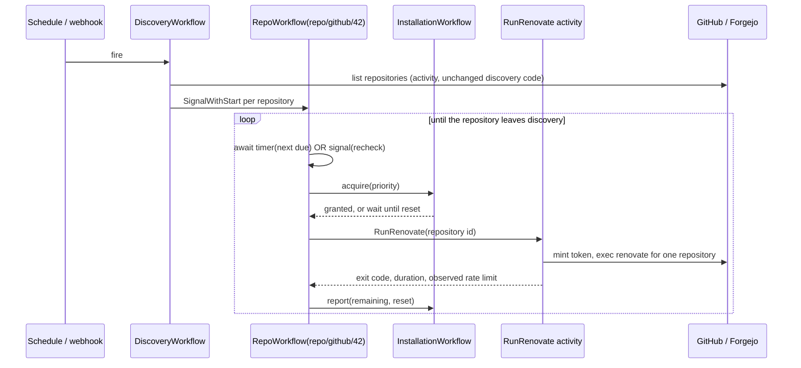
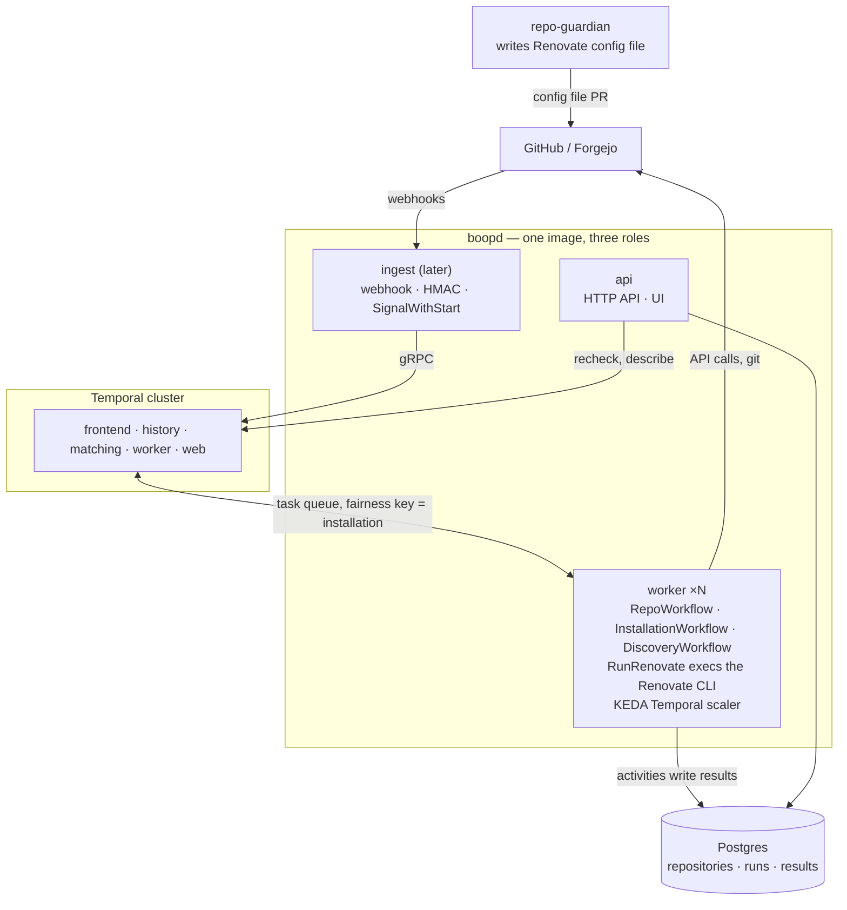

<!-- markdownlint-disable-file MD025 MD041 -->

<!--toc:start-->

- [Question](#question)
- [Hypothesis](#hypothesis)
- [Context](#context)
- [Approach](#approach)
- [Environment](#environment)
- [Findings](#findings)
  - [Observation 1: today's control plane is small, and none of it is hand-built queueing](#observation-1-todays-control-plane-is-small-and-none-of-it-is-hand-built-queueing)
  - [Observation 2: the planned state DB is the workflow engine](#observation-2-the-planned-state-db-is-the-workflow-engine)
  - [Observation 3: the natural model is one workflow per repository](#observation-3-the-natural-model-is-one-workflow-per-repository)
  - [Observation 4: Renovate is a Node process, so where it runs is the real design question](#observation-4-renovate-is-a-node-process-so-where-it-runs-is-the-real-design-question)
  - [Observation 5: the rate budget is coarser than repo-guardian's](#observation-5-the-rate-budget-is-coarser-than-repo-guardians)
  - [Observation 6: the new service has its own API; the CRDs stay with the operator](#observation-6-the-new-service-has-its-own-api-the-crds-stay-with-the-operator)
  - [Observation 7: what the new service takes from this repository](#observation-7-what-the-new-service-takes-from-this-repository)
  - [Observation 8: most of the plumbing exists as reference code](#observation-8-most-of-the-plumbing-exists-as-reference-code)
  - [Observation 9: the central service is the production path, and repo-guardian onboards](#observation-9-the-central-service-is-the-production-path-and-repo-guardian-onboards)
  - [Observation 10: a run that outlives its token has to converge, not retry forever](#observation-10-a-run-that-outlives-its-token-has-to-converge-not-retry-forever)
  - [Observation 11: "same result" is defined on Renovate's report, not on PRs](#observation-11-same-result-is-defined-on-renovates-report-not-on-prs)
- [Options](#options)
- [Conclusion](#conclusion)
- [Beyond v1](#beyond-v1)
- [Recommendation](#recommendation)
  - [Spike](#spike)
  - [Open questions](#open-questions)
- [Handoff: starting boop](#handoff-starting-boop)
  - [Sources](#sources)
  - [Decisions already made](#decisions-already-made)
  - [Renovate behaviours to reproduce](#renovate-behaviours-to-reproduce)
  - [Spike scope](#spike-scope)
  - [First steps, in order](#first-steps-in-order)
- [References](#references)

<!--toc:end-->

## Question

Should the next version of this project replace the kubebuilder operator (three
CRDs, three reconcilers, one Indexed Job per Run) with Temporal workflows, the
way repo-guardian v2 replaced its Valkey control plane (repo-guardian INV-0019,
DESIGN-0026)?

Concretely: what shape do the workflows take, where does the Renovate process
itself run, what happens to the CRD API, what code goes away, and what has to be
proven in a spike before a DESIGN.

## Hypothesis

That Temporal fits, but for a different reason than it fitted repo-guardian.
repo-guardian v1 had already built a workflow engine by hand, and Temporal
deleted it. This operator has not built one yet. It is about to: DESIGN-0001's
"Future architecture: state DB" section plans an operator-owned Postgres and a
scheduler with rate-budget admission, time-spreading, failure-aware completion
and replay. The expectation is that Temporal replaces that plan and fixes the
known v0.1 limits on the way. repo-guardian is the worked example of when the
move pays off, and a source of reference code. It is not a dependency.

The expected cost is the Kubernetes-native API. The RFC's case against
`mogenius/renovate-operator` leaned on single-purpose CRDs, conditions and
`kubectl get renovaterun`. Most of that does not survive.

## Context

v0.1.0 shipped 2026-05-01 and surfaced five investigations during the homelab
cutover (INV-0001 to INV-0005). DESIGN-0001 deferred three things to a
"scheduler rework": cross-Run rate budgeting, a replacement for ConfigMap
sharding, and failure-tolerant Run completion. v0.2.0 was also meant to add
webhook-triggered runs.

Since then repo-guardian moved its control plane to Temporal (`v2` branch,
`v2.0.0-rc.4`). The direction is already chosen: build a Temporal-based way to
run Renovate for the same reasons. This investigation is to find the shape and
the risks, not to decide whether. It concludes that the Temporal version is a
new service in its own repository, `boop`, alongside the operator rather than
replacing it (OQ7). "The new service" below means `boopd`, the service built
from that repository.

**Triggered by:** DESIGN-0001 § Future architecture: state DB; repo-guardian
INV-0019 and DESIGN-0026.

## Approach

1. Inventory the operator's control-plane mechanisms and map each to a Temporal
   primitive.
2. Measure the code by package and sort it into deleted, reshaped and kept.
3. Compare against repo-guardian v2's workflow set and note what is reusable
   as-is.
4. Work out where the Renovate process runs, since an activity cannot run a Node
   CLI in-process the way repo-guardian runs its Go engine.
5. List what is unverified and turn it into spike criteria.

Temporal's behaviour (Update-with-Start, fairness keys, `NextRetryDelay`,
Schedules, the KEDA scaler) is taken from repo-guardian INV-0019 and
DESIGN-0026, which verified it at the source. It was not re-verified here.

## Environment

| Component             | Version / Value                                                         |
| --------------------- | ----------------------------------------------------------------------- |
| renovate-operator     | `main` @ `c31d1c6`                                                      |
| repo-guardian         | `v2` @ `278c7ec` (`v2.0.0-rc.4`)                                        |
| Temporal Go SDK       | `go.temporal.io/sdk` v1.49.0 (repo-guardian `go.mod`)                   |
| Temporal Server floor | 1.31 (DESIGN-0026: fairness GA, Update-with-Start GA, `NextRetryDelay`) |
| Renovate              | v43.x (INV-0003 recorded v43.160.5)                                     |
| controller-runtime    | v0.23.1                                                                 |

## Findings

### Observation 1: today's control plane is small, and none of it is hand-built queueing

| Mechanism today                                                | Where                                  | Temporal primitive                           |
| -------------------------------------------------------------- | -------------------------------------- | -------------------------------------------- |
| Cron evaluation, `computeFireTimes`, `RequeueAfter`            | `renovatescan_controller.go`           | Schedule, or a per-repository timer          |
| `concurrencyPolicy` and active-Run tracking                    | `renovatescan_controller.go`           | workflow ID uniqueness                       |
| Run state machine `Pending → Discovering → Running → terminal` | `renovaterun_controller.go`            | workflow code                                |
| Discovery with a per-installation token bucket                 | `internal/platform`                    | activity, plus the installation budget       |
| Shard plan in a ConfigMap, gzip above 900 KiB                  | `internal/sharding`                    | none needed: the task queue is the work list |
| Indexed Job, `backoffLimitPerIndex`                            | `internal/jobspec`                     | activity retry policy                        |
| Mint token, mirror it into a per-Run Secret                    | `internal/credentials`, Run controller | token minted inside the activity             |
| Run history and GC (`gcOldRuns`, Job TTL)                      | Scan controller                        | namespace retention                          |
| Leader election                                                | controller-runtime                     | not needed                                   |

Non-test Go, measured on `main`:

| Package                        | LOC   | Tests LOC |
| ------------------------------ | ----- | --------- |
| `api/v1alpha1` (564 generated) | 1,304 | 0         |
| `internal/controller`          | 1,415 | 3,296     |
| `internal/platform`            | 1,059 | 1,537     |
| `internal/jobspec`             | 494   | 650       |
| `internal/observability`       | 316   | 250       |
| `cmd`                          | 279   | 0         |
| `internal/sharding`            | 216   | 269       |
| `internal/credentials`         | 151   | 214       |
| `internal/conditions`          | 132   | 120       |
| `internal/clock`               | 38    | 49        |

Unlike repo-guardian v1 there is no queue, reaper, delayed-requeue machinery or
leader-election code to delete. controller-runtime and `batch/v1.Job` already
provide them. The deletion argument from INV-0019 Observation 1 does not apply
to v0.1 as built.

### Observation 2: the planned state DB is the workflow engine

DESIGN-0001 § Future architecture plans, for v0.2.0 and later:

> an operator-owned state database (Postgres, deployed alongside the operator)
> that stores: discovered repo lists, per-Run shard plans, per-installation
> rate-budget ledger, Run history ... The Scan controller becomes a real
> scheduler: admission control by rate budget, time-spreading across the cron
> window, failure-budget-aware completion, and replay/retry.

That is the system repo-guardian v1 built one post-mortem at a time and v2
removed. Each known v0.1 limit also has a direct answer:

| v0.1 limit                                                                                                                             | Source                         | Under Temporal                                                                                         |
| -------------------------------------------------------------------------------------------------------------------------------------- | ------------------------------ | ------------------------------------------------------------------------------------------------------ |
| The installation token is minted once per Run and lasts about 1h, so a shard that runs longer than about 50 minutes gets 401s mid-scan | CLAUDE.md, INV-0003            | one activity per repository mints its own token; the activity timeout is kept below the token lifetime |
| One ConfigMap holds every shard, against etcd's 1 MiB cap                                                                              | `sharding/shard_builder.go`    | no shard object exists                                                                                 |
| Any failed shard fails the Run                                                                                                         | DESIGN-0001 resolved questions | per-repository retry policy; one bad repository affects only itself                                    |
| Rate budget is per Run, not shared across Runs or Scans                                                                                | DESIGN-0001 resolved questions | one `InstallationWorkflow` per installation (Observation 5)                                            |
| Worker count is fixed when the Job is created                                                                                          | DESIGN-0001 non-goals          | worker pool scales on task-queue backlog                                                               |
| No webhook-triggered runs                                                                                                              | RFC-0001 phase 2               | `SignalWithStart` on the repository's workflow                                                         |
| `concurrencyPolicy: Replace` is unimplemented                                                                                          | DESIGN-0001 resolved questions | the question disappears with Runs                                                                      |

The new service still has a Postgres (OQ5), but for a different job. The
DESIGN-0001 database was scheduling state: shard plans, the budget ledger, retry
bookkeeping. Temporal holds all of that. The new store holds product data
(repositories, run results, proposed updates) for the API and UI to read, and
nothing in it drives scheduling.

### Observation 3: the natural model is one workflow per repository

The unit of work is "this repository is due for a Renovate pass, or something
just happened to it". A Run that batches thousands of repositories is an
artefact of launching one Job.

| Workflow               | ID                                     | Started by          | Lifetime                                                          |
| ---------------------- | -------------------------------------- | ------------------- | ----------------------------------------------------------------- |
| `RepoWorkflow`         | `repo/<platform>/<repo id>`            | discovery, webhooks | until the repository leaves discovery; ContinueAsNew periodically |
| `InstallationWorkflow` | `installation/<platform>/<id>`         | first `acquire`     | long-lived                                                        |
| `DiscoveryWorkflow`    | `discovery/<platform>/<schedule time>` | Temporal Schedule   | one run                                                           |

This is repo-guardian's set minus policy rollout, bootstrap and snapshots. The
cron expression on a Scan becomes either the discovery Schedule plus a
per-repository interval, or a window that discovery spreads repositories across.
Time-spreading, which the state-DB plan listed as new scheduler work, is then a
jittered timer.

Load is small. 30,000 repositories on a 24h cadence is about 0.35 workflow
wake-ups per second. At the 30 to 60 seconds per repository that repo-guardian
DESIGN-0009 cites, the same fleet needs about 375 worker-hours a day, which is
roughly 16 Renovate processes running continuously. That number is an estimate
from someone else's measurement and the spike should replace it.

### Observation 4: Renovate is a Node process, so where it runs is the real design question

repo-guardian's engine is Go and runs inside the activity. Renovate is a Node
CLI in its own image, so the activity has to get a Renovate process from
somewhere. This question has no equivalent in INV-0019.

|                                    | A: worker pool execs Renovate                                               | B: activity launches a Job per repository                      | C: activity launches today's Indexed Job    |
| ---------------------------------- | --------------------------------------------------------------------------- | -------------------------------------------------------------- | ------------------------------------------- |
| **Worker image**                   | Renovate image plus the Go worker binary                                    | Go worker only                                                 | Go worker only                              |
| **Activity does**                  | mint token, `exec renovate` for one repository, heartbeat, return exit code | create Job, watch it, heartbeat                                | build shard ConfigMap, create Job, watch it |
| **Kubernetes RBAC for the worker** | none                                                                        | Jobs, Secrets in a worker namespace                            | as today                                    |
| **Token lifetime problem**         | solved                                                                      | solved                                                         | not solved                                  |
| **ConfigMap cap**                  | gone                                                                        | gone                                                           | remains                                     |
| **Per-repository retry**           | yes                                                                         | yes                                                            | no                                          |
| **Scaling**                        | KEDA on task-queue backlog                                                  | cluster capacity, Job churn (30,000 pods a day at fleet scale) | fixed at Job creation                       |
| **Cache**                          | package cache warm via Redis; filesystem fresh per activity (see below)     | package cache warm via Redis; filesystem fresh per pod         | cold per Run                                |
| **Isolation between repositories** | shared filesystem and process user within a worker                          | pod per repository                                             | pod per shard                               |
| **Code deleted**                   | controller, jobspec, sharding, credentials                                  | controller, sharding; jobspec reshaped                         | little                                      |

Option C is Temporal as a cron replacement and fixes almost nothing in
Observation 2. Option B keeps pod isolation and pays for it in pod churn and in
the worker needing cluster write access.

Option A is the shape closest to repo-guardian and to Mend's own
server-plus-worker architecture. Its risk is isolation, and the obvious benefit
of a long-lived worker (a warm cache on disk) is the same thing as the risk.

**The threat.** Renovate's `allowScripts` defaults to `false` and
`allowedCommands` to `[]`, so by default a repository cannot run install scripts
or post-upgrade commands. Package managers invoked for lock-file updates still
parse, and in some ecosystems execute, repository content (build wrappers,
dependency build backends). With A, one worker pod handles many repositories in
sequence, so anything a repository's package-manager step writes to disk can be
read by the next repository's run on that pod. A checkout is the obvious target,
but a shared cache is the worse one: a poisoned toolchain, module cache or
lockfile resolution is silent and spreads to every repository that later reads
it.

**Split the cache by who writes it.** Renovate's disk state falls into three
kinds:

| State                                              | Written by                                       | Shape under A                                                                                |
| -------------------------------------------------- | ------------------------------------------------ | -------------------------------------------------------------------------------------------- |
| Toolchains (node, python, go, java, …)             | `binarySource=install` at run time               | baked into the image, `binarySource=global`, read-only root filesystem                       |
| Datasource / lookup cache (registry responses)     | the Renovate process itself, from registry data  | Redis via `redisUrl`, shared across all workers                                              |
| Package-manager caches, checkout, repository cache | package managers running against repository data | fresh `baseDir` and `cacheDir` per activity on an `emptyDir`, deleted when the activity ends |

Only the Renovate process writes the shared state. Child processes started by
package managers get Renovate's filtered environment (`exposeAllEnv` defaults to
`false`), so they do not see the Redis URL, its password or the platform token.
That claim is from Renovate's docs and has to be verified in the spike.

**What that costs.** Most of the warm-cache benefit comes from datasource
lookups, and Redis keeps it. Package-manager caches start cold per repository.
That is the same cache profile option B gets, so warm caching no longer
separates A from B. What still separates them is pod churn, cluster write access
for the worker, and start-up latency per repository.

**Residual risk.** Redis is reachable over the network from the worker pod. A
child process that finds it without credentials is blocked by Redis `AUTH`. A
repository that escapes the package-manager sandbox far enough to read the
parent Renovate process's memory or environment has already beaten process
isolation, and the only defence against that is B's pod-per-repository.
Mitigations that stay: one activity slot per worker pod (no concurrent
neighbours), tokens minted per activity and never written to disk.

### Observation 5: the rate budget is coarser than repo-guardian's

repo-guardian's `CheckRepo` makes its own API calls through its own transport,
so it reports exact spend to `InstallationWorkflow`. Here Renovate makes the
calls inside Node, and the Go side cannot count them.

What the Go side can do is read `GET /rate_limit` with the same installation
token before and after each run. GitHub documents that "accessing this endpoint
does not count against your REST API rate limit." So `report(remaining, reset)`
still works, and the EWMA of calls per run is derived from the difference, which
is noisy when several runs for one installation overlap.

Three consequences:

- The gate is admission control, not accounting. It stops new runs when the
  installation is near its reserve. It cannot stop a run in flight.
- Renovate handles its own throttling once started. A run that hits the limit
  mid-way shows up as a long or failed activity, and the retry policy needs
  `NextRetryDelay` set from the observed reset.
- Forgejo has no installation budget. For Forgejo the `InstallationWorkflow`
  degrades to a concurrency cap.

GitHub's rate limit belongs to the installation, not to the process that spends
it. `/rate_limit` reports what every client using that installation has spent,
so another consumer on the same App shows up in the readings but is not under
the gate's control. The budget is only meaningful if the Renovate App is used by
Renovate alone. That is already true for v0.1 (one Platform per installation)
and becomes a stated deployment requirement.

### Observation 6: the new service has its own API; the CRDs stay with the operator

The Temporal service is not a new version of the operator. It is a second way to
run Renovate, in its own repository (OQ7), and the operator continues here with
its CRDs. The two do not have to match feature for feature. So the question is
not what replaces the CRDs, but what the new service offers instead of them.

| CRD                | What it holds                                               | In the new service                                                                        |
| ------------------ | ----------------------------------------------------------- | ----------------------------------------------------------------------------------------- |
| `RenovateRun`      | one execution's state                                       | a run record in the service store, written by the activity; the workflow does the work    |
| `RenovateScan`     | schedule, discovery filter, worker bounds, config overrides | platform and schedule config in a service config file; worker bounds become KEDA settings |
| `RenovatePlatform` | endpoint, auth reference, runner config, image              | service config                                                                            |

RFC-0001 argued for CRDs on three grounds: RBAC split between the platform team
and app teams, `kubectl` ergonomics, and GitOps. In the new service:

- **RBAC split.** App teams own their Renovate behaviour through the config file
  in their repository and the shared preset. Whether a repository takes part at
  all is decided by that file being present (Observation 9), not by a
  cluster-side filter.
- **Visibility.** The service's own HTTP API and UI, backed by its store (OQ5),
  list repositories, runs and results. This goes further than
  `kubectl get renovaterun` did: history across runs, per-repository state, and
  later the eval and priority data from [Beyond v1](#beyond-v1). The Temporal UI
  stays an operator tool for debugging workflows.
- **GitOps.** Platform and schedule config lives in a file shipped with the
  chart values, reconciled at worker start the way repo-guardian's
  `PolicyRolloutWorkflow` is.

The new service has no CRDs (OQ3). A CRD front end that turns Platform and Scan
into Schedules would give it two control planes, which is what DESIGN-0021's
one-mechanism rule in repo-guardian exists to prevent. Users who want CRDs have
the operator.

### Observation 7: what the new service takes from this repository

Nothing is deleted here. The operator keeps its code and its roadmap. The
question is what the new repository reuses. Assuming execution option A:

| Fate                             | Code                                                                                                                                   | LOC    |
| -------------------------------- | -------------------------------------------------------------------------------------------------------------------------------------- | ------ |
| **Operator only**                | `api/v1alpha1`, `internal/controller`, `internal/sharding`, `internal/credentials`, `internal/conditions`, `internal/clock`            | ~3,250 |
| **Shared via `donaldgifford/x`** | `internal/platform` (discovery, `MintAccessToken`, error classification)                                                               | ~1,060 |
| **Used as a pattern**            | `internal/jobspec/env.go` (Renovate env and config assembly) as the model for the activity's process builder; `internal/observability` | ~800   |
| **Not needed**                   | the kubebuilder scaffold and Makefile, the `autoupdate` workflow, the Helm-plugin chart, envtest, CEL validation                       | —      |

Proportionally the new service is new code that shares one package with the
operator. That is different from repo-guardian, where the engine was most of the
code and stayed untouched. What carries over most is knowledge: the five
investigations and the v0.1.x bug list in CLAUDE.md describe Renovate behaviours
(token passed as `RENOVATE_TOKEN`, `forgejo` not `gitea`, `LOG_LEVEL` as env
only, App-grant-aware discovery) that the new activity has to reproduce. They
should become test cases in the new repository before its `RunRenovate` activity
is written.

`internal/platform` moves to `x` in Phase 0 (OQ6). The operator can switch to
the `x` copy when convenient. It is not required to, because the two products do
not have to match.

### Observation 8: most of the plumbing exists as reference code

INV-0019 Observation 5 counted operating Temporal as the main cost, and that
holds here: this project takes on a Temporal cluster as a new dependency. What
repo-guardian v2 provides is a worked deployment (reference values for the
upstream chart in `contrib/temporal/`, a server version floor, a CNPG
persistence layout) and code to copy. Nothing here depends on repo-guardian
being deployed or on its release schedule.

Code in repo-guardian `v2` that can be copied with little change:

| Piece                                                                                | File                                       | LOC  |
| ------------------------------------------------------------------------------------ | ------------------------------------------ | ---- |
| Config from env, mTLS, OIDC, `Dial`, `CheckServerVersion`, `Ping`                    | `internal/temporal/temporal.go`, `oidc.go` | ~410 |
| Worker options, build ID, worker deployment versioning                               | `worker.go`, `deployment.go`               | ~300 |
| `EnsureSchedule`, `DescribeBacklog`                                                  | `schedules.go`, `backlog.go`               | ~110 |
| Budget entity: `acquire` Update, `report` Signal, leases, sweep, ContinueAsNew drain | `internal/workflows/installation.go`       | 346  |
| Priority and fairness keys, activity option presets                                  | `internal/workflows/options.go`            | 62   |

That is about 1,200 lines. The spike copies them. Phase 0 of the real build
extracts them, with `internal/platform`, into `donaldgifford/x`, which both
repo-guardian and the new service then import (OQ6).

The new service's homelab install is one chart plus a Temporal cluster and a
Postgres for its store. The operator stays one chart.

### Observation 9: the central service is the production path, and repo-guardian onboards

repo-guardian DESIGN-0009 (Approved) distributes Renovate as a per-repository
GitHub Actions workflow that repo-guardian enforces as a managed file. It solves
the same serial-execution problem with no central worker at all.

The central service is the production path, not Actions (OQ1). The Actions-based
design is not being pursued for Renovate, so Observations 4 and 5 are sized for
production, not only for the homelab.

repo-guardian keeps a role, as the onboarding mechanism. It writes the Renovate
config file into repositories that lack one. The new service onboards a
repository when, and only when, that file is present:

- Discovery lists the repositories the installation can see and keeps only those
  that contain the config file. Only those get a `RepoWorkflow`.
- Renovate's own onboarding is off (`onboarding: false`,
  `requireConfig: required`). repo-guardian owns the onboarding PR, so Renovate
  never opens one.
- A repository whose config file is deleted leaves discovery, and its
  `RepoWorkflow` ends (Observation 3).
- A push that adds the config file is the natural webhook trigger for
  onboarding. Until ingest exists (OQ8), the next discovery pass picks it up.

### Observation 10: a run that outlives its token has to converge, not retry forever

Per-repository tokens fix the v0.1 failure where a long shard hits 401 partway
through. They do not fix a single repository that needs longer than the token
lives (about 1h on github.com). Renovate reads the token once at start and uses
it for API calls and for git over HTTPS, so there is no refresh inside the
process. Putting a credential-injecting proxy between Renovate and GitHub would
work, but it is a second product.

With the activity timeout below the token lifetime and a plain retry policy, the
failure mode is a repository that times out every attempt and retries forever
without anyone noticing.

The way out depends on how Renovate behaves when it is re-run. Each pass
recomputes the branches the repository should have and skips those already up to
date. A run killed at minute 50 has still pushed the branches it finished, so
the next attempt, with a fresh token, starts further along. If that holds, a
timeout is partial progress, not a failure:

| Case                                      | Handling                                                                                                                                     |
| ----------------------------------------- | -------------------------------------------------------------------------------------------------------------------------------------------- |
| Activity finishes                         | done; next due time from the schedule                                                                                                        |
| Activity times out, report shows progress | retry at once with a new token; does not count toward the limit                                                                              |
| Activity times out, no progress           | counts toward a limit (3); at the limit `RepoWorkflow` records `stalled`, emits a metric and waits for the next due time instead of retrying |
| Killed mid-push                           | covered by the same path; the next pass sees the half-pushed branch and rebases or recreates it (to verify)                                  |

"Progress" is measured as branches created or updated since the last attempt,
from Renovate's report (Observation 11). Renovate's own limits
(`prConcurrentLimit`, `branchConcurrentLimit`, `prHourlyLimit`) also cap how
much one pass tries to do, which keeps most passes short. The timeout stays
fixed and the loop resumes, so no per-repository timeout tuning is needed.

Forgejo tokens are long-lived, so this only binds on GitHub. The Forgejo timeout
can be longer, but the stall limit still applies so that a hung process is
noticed.

### Observation 11: "same result" is defined on Renovate's report, not on PRs

The spike compares option A against the v0.1 operator. Comparing opened PRs is
the wrong test. The two sides would race to push the same branches, and PR state
depends on when each side ran and on what was already open.

Renovate's own limits are per repository (`prConcurrentLimit`, `prHourlyLimit`,
`branchConcurrentLimit`), so running one repository per process instead of many
per shard should not change what gets proposed. The differences that do occur
come from timing: a new upstream release, or a `minimumReleaseAge` boundary
crossed between the two runs.

So the comparison is:

- Both sides run with `dryRun: full` and `reportType: file`, against the same
  repositories, started within a few minutes of each other.
- Each report is reduced to a set of
  `(repository, branchName, depName, newVersion)` tuples plus the list of
  repository-level problems.
- **Pass:** the sets are equal. Every difference is explained by a release or
  age boundary between the two start times, which can be confirmed by re-running
  the side that ran first.

Neither side writes to the platform, so there are no branches to fight over. The
same report is what Observation 10 uses to measure progress, and what the
"Result capture" spike criterion needs, so one mechanism covers three uses.

## Options

The comparison below is between ways of evolving the design, not between the two
products. The operator keeps the first column and may grow on its own roadmap.
The new service is the last column.

|                       | Operator as built (v0.1) | Operator + state DB (DESIGN-0001 plan) | boopd (Temporal, execution A)                                    |
| --------------------- | ------------------------ | -------------------------------------- | ---------------------------------------------------------------- |
| **Unit of work**      | shard of a Run           | shard of a Run                         | repository                                                       |
| **Onboarding**        | Scan discovery filter    | Scan discovery filter                  | config file present, written by repo-guardian                    |
| **Token lifetime**    | breaks past ~50 min      | needs refresh logic                    | per-repository token; long runs converge (Observation 10)        |
| **Shard storage**     | ConfigMap, 1 MiB cap     | Postgres                               | none                                                             |
| **Failure handling**  | any shard fails the Run  | new code                               | retry policy, stall limit                                        |
| **Rate budget**       | per Run                  | new ledger                             | `InstallationWorkflow`, admission only                           |
| **Webhook triggers**  | none                     | new code                               | `SignalWithStart`                                                |
| **Scaling**           | fixed per Job            | fixed per Job                          | KEDA on backlog                                                  |
| **User-facing API**   | CRDs, `kubectl`          | CRDs, `kubectl`                        | HTTP API and UI over its own store; Temporal UI for operators    |
| **Run history**       | last N Runs, GC'd        | Postgres                               | Postgres                                                         |
| **New dependency**    | none                     | Postgres                               | Temporal cluster, Postgres                                       |
| **Isolation**         | pod per shard            | pod per shard                          | fresh directories per activity, one activity per pod             |
| **New failure class** | none                     | none                                   | workflow determinism and versioning; store and workflow drifting |

## Conclusion

**Answer:** Yes, as a new service in a new repository (`boop`), not as the next
version of the operator. Temporal replaces the scheduler rework the operator was
going to build. Changing the unit of work from a shard to a repository fixes the
token-lifetime, ConfigMap and all-or-nothing limits along the way. The operator
continues here as the other option: Renovate on a cron in Kubernetes, managed
through CRDs, with no Temporal or Postgres to run. The two do not have to match
feature for feature.

Three things should be said plainly:

- **It is new code, not a port.** One package (`internal/platform`) is shared,
  through `donaldgifford/x`. What carries over most is the recorded Renovate
  behaviour, as test cases.
- **The store makes it a product, not just a scheduler.** A Postgres of
  repositories, runs and results, with an HTTP API and UI on top, is what the
  eval and priority work in [Beyond v1](#beyond-v1) builds on. The price is a
  second source of state next to Temporal, which needs a clear owner for each
  kind of data.
- **The budget is weaker.** Admission control from `/rate_limit` readings, not
  exact accounting.

The recommended shape is:

- a per-repository entity workflow, started only for repositories that contain
  the Renovate config file written by repo-guardian;
- an installation budget entity, copied from repo-guardian and later shared
  through `x`;
- a worker pool that execs Renovate (option A), with nothing writable shared on
  disk between repositories, which the spike has to confirm;
- Postgres as the record of repositories and run results, written by activities
  and read by the API.

## Beyond v1

Two features justify the store and the API. Both belong to the new service only.
The operator will not get them. Neither is in v1 scope, but v1 has to record the
data they need.

**Automerge confidence from evals.** Run an eval harness (jev or similar)
against each Renovate PR and store the result as a confidence level: how likely
the bump is to be safe to merge without review. Over time the confidence per
dependency, per version jump and per repository becomes the input to automerge
rules. Each Renovate PR is a record in the store that an eval result attaches
to.

**Priority report with security findings.** Cross-reference open security
findings (Wiz, and platform advisories) against pending Renovate bumps. The
output is a ranked list of PRs, each with a statement such as: "bumping `foo`
from 1.2.2 to 1.2.3 resolves 14 open findings in this repository, and evals rate
it high confidence, low impact." The join is on package, affected version range
and the bump's target version, so the store needs those fields per PR.

What v1 has to get right so these can be added without migrating history:

- One record per proposed update: repository, branch, PR number, and for each
  dependency: manager, package name, from-version and to-version. The report
  tuples from Observation 11 are this record's seed, so the data already exists
  and only has to be kept.
- A stable PR identity across runs, so eval results and findings stay attached
  when Renovate rebases or updates the branch.
- An API that returns runs and PRs per repository, which the later views extend
  rather than replace.

Findings ingestion, the eval runner and scoring are designed later, in their own
documents.

## Recommendation

1. **Do not build the scheduler rework in the operator.** Mark DESIGN-0001 §
   Future architecture as superseded by this investigation. The operator keeps
   its current execution model; the new service's store is a product database,
   not the scheduling ledger that section planned.
2. **Ship v0.1.2 of the operator.** The bundled fixes give the homelab a working
   baseline to compare against. After that the operator follows its own roadmap.
3. **Create `donaldgifford/boop`** for the Temporal service (OQ7). This
   investigation, and the DESIGN it leads to, move there or are referenced from
   there.
4. **Turn the v0.1.x bug list into a behaviour test suite** for the
   `RunRenovate` activity in the new repository before the activity is written
   (Observation 7).
5. **Run the spike below in the homelab**, in a `renovate` Temporal namespace,
   copying repo-guardian code.
6. **Phase 0 of the real build: extract the shared code into
   `donaldgifford/x`.** repo-guardian's Temporal plumbing and budget entity plus
   this repository's `internal/platform`, imported by repo-guardian and the new
   service (OQ6).
7. **Write the DESIGN after the spike**, resolving the remaining open questions
   and including the store schema that [Beyond v1](#beyond-v1) depends on.

### Spike

Build the smallest version of execution option A:

- A worker image: the Renovate full image (toolchains baked in,
  `binarySource=global`) plus the Go worker binary, read-only root filesystem.
- A Redis for the datasource cache (`redisUrl`).
- `RunRenovate(repo)`: mint a token through `internal/platform`, exec `renovate`
  with `RENOVATE_REPOSITORIES` set to one repository, a fresh `baseDir` and
  `cacheDir` on an `emptyDir`, and `reportType: file`; heartbeat while it runs,
  kill the child on cancellation, delete the directories on exit, return exit
  code, duration and the parsed report.
- `RepoWorkflow` with a timer, a `recheck` signal and the stall limit from
  Observation 10, copied from repo-guardian and adapted.
- `InstallationWorkflow` copied from repo-guardian, fed from `/rate_limit`
  before and after.
- `DiscoveryWorkflow` on a Schedule, using the existing discovery code.
- Comparison runs against the v0.1.x operator with both sides in `dryRun: full`
  (Observation 11).

Success criteria:

| Question                                                  | Pass                                                                                                                                                                                                                                                                   |
| --------------------------------------------------------- | ---------------------------------------------------------------------------------------------------------------------------------------------------------------------------------------------------------------------------------------------------------------------- |
| Does a per-repository run behave the same as a shard run? | report tuple sets equal for the homelab's GitHub and Forgejo repositories, or every difference explained by a release/age boundary (Observation 11)                                                                                                                    |
| Per-repository overhead                                   | measured seconds per repository with a warm Redis versus a cold one; replaces the estimate in Observation 3                                                                                                                                                            |
| Worker death                                              | killing a worker pod mid-run leaves no orphan process and the activity retries elsewhere after the heartbeat timeout                                                                                                                                                   |
| Token lifetime                                            | no 401s across a full pass; activity timeout below token lifetime                                                                                                                                                                                                      |
| Convergence                                               | with the activity timeout forced to 2 minutes, a repository with many pending updates reaches the same report as an uninterrupted run within a bounded number of attempts, with no duplicate or broken branches (run live, not `dryRun`, against a scratch repository) |
| Stall                                                     | a repository that makes no progress (for example a hung package manager) is marked `stalled` after 3 attempts and stops retrying until its next due time                                                                                                               |
| Budget signal                                             | `/rate_limit` difference per run is stable enough to drive an EWMA with 4 concurrent runs on one installation                                                                                                                                                          |
| Isolation: disk                                           | a test repository whose package-manager step writes into `cacheDir`, `baseDir` and `/tmp` leaves nothing a later activity on the same pod can read                                                                                                                     |
| Isolation: environment                                    | the same step cannot see the platform token, `RENOVATE_*` variables or the Redis URL/password in its environment (`exposeAllEnv=false` verified)                                                                                                                       |
| Result capture                                            | exit code plus the parsed report is enough to say what a run did without reading raw logs                                                                                                                                                                              |
| Log correlation                                           | child process logs reach Loki labelled with repository and workflow ID                                                                                                                                                                                                 |

### Open questions

- **OQ1 — Which Renovate path is production at work?** (a) per-repo GitHub
  Actions (repo-guardian DESIGN-0009), with this service for the homelab and
  Forgejo; (b) this service; (c) both by platform. **Resolved: (b).** The
  central service runs Renovate per repository. repo-guardian writes the config
  file, and a repository is onboarded when the file is present (Observation 9).
- **OQ2 — Execution model.** (a) worker pool execs Renovate; (b) Job per
  repository; (c) Indexed Job per pass. Recommended: (a), subject to the
  isolation criterion. Fallback is (b).
- **OQ3 — CRDs.** (a) none, config file only; (b) keep Platform and Scan as thin
  config CRDs. **Resolved: (a) for the new service.** One control plane. The
  CRDs stay with the operator, which remains the Kubernetes-native option
  (Observation 6).
- **OQ4 — Workflow granularity.** (a) entity per repository; (b) one short
  workflow per pass that fans out activities. Recommended: (a), because webhooks
  and per-repository dedupe need a stable ID. (b) is simpler if webhooks are
  dropped.
- **OQ5 — Does it need its own store?** (a) no database: Temporal history, logs
  and metrics only; (b) a small results table for a status page; (c) a Postgres
  store behind an HTTP API and UI. **Resolved: (c).** The store is the record of
  repositories, runs and proposed updates, and the base for evals and the
  priority report ([Beyond v1](#beyond-v1)). Temporal owns execution state;
  activities write results to the store; the API reads the store and only
  signals or describes workflows. Which data lives where is decided in the
  DESIGN, after the spike.
- **OQ6 — Shared Temporal module.** (a) copy from repo-guardian and own the
  copy; (b) extract `internal/temporal` and the budget entity into a shared Go
  module. **Resolved: both, in order.** The spike copies. Phase 0 of the real
  build extracts repo-guardian's Temporal plumbing and budget entity, plus
  `internal/platform` from this repository, into `donaldgifford/x`. `x` is one
  Go module of shared packages, all versioned together; consumers pin one `x`
  version.
- **OQ7 — Repository and name.** (a) new major version in this repository; (b) a
  new repository, with this one archived at v0.1.x; (c) a new repository, with
  this one continuing as the operator. **Resolved: (c).** Nothing in the
  kubebuilder layout suits a Temporal service with a store, API and UI. The two
  are separate options for running Renovate and do not have to match. The new
  repository is `donaldgifford/boop`: short, playful, and not tied to Renovate's
  name, which fits a service whose later value (evals, security priority) goes
  beyond running Renovate. Naming: `boop` is the repository, `boopd` the service
  (binary, image, chart and Temporal namespace), and `boop-bot` the GitHub App
  and Forgejo user that opens PRs. Check availability on GitHub, GHCR and as a
  chart name before creating it.
- **OQ8 — Webhook ingest.** (a) its own `ingest` role; (b) schedule only in the
  first version. Recommended: (b). Add ingest once the per-repository loop is
  proven. The first webhook worth handling is a push that adds the Renovate
  config file, because it makes onboarding immediate (Observation 9).

## Handoff: starting `boop`

This section is written to be handed to an agent working in the new
`donaldgifford/boop` repository, which cannot see this repository's CLAUDE.md or
code. Copy this whole investigation into `boop`'s `docs/` as its founding
document and point the agent at this section first. Everything it needs to start
the spike is here or linked by absolute reference.

### Sources

| What                                  | Where                                                                                                                                                                                      |
| ------------------------------------- | ------------------------------------------------------------------------------------------------------------------------------------------------------------------------------------------ |
| Platform clients to copy (with tests) | `github.com/donaldgifford/renovate-operator` `main`, `internal/platform/` (`platform.go`, `github/`, `forgejo/`)                                                                           |
| Renovate env and config assembly      | same repository, `internal/jobspec/env.go` (`buildEnv`, `mergeRenovateConfig`, `resolveLogLevel`, `renovatePlatformID`); a pattern to follow, not code to copy (it builds `corev1.EnvVar`) |
| Temporal plumbing to copy             | `github.com/donaldgifford/repo-guardian` `v2` @ `278c7ec`: `internal/temporal/` (`temporal.go`, `oidc.go`, `worker.go`, `deployment.go`, `schedules.go`, `backlog.go`)                     |
| Budget entity and option presets      | same, `internal/workflows/installation.go`, `internal/workflows/options.go`                                                                                                                |
| Temporal deployment reference         | same, `contrib/temporal/`; version floor and rationale in repo-guardian DESIGN-0026                                                                                                        |
| Background investigations             | renovate-operator `docs/investigation/` INV-0003 (token minting), INV-0004 (App-grant discovery)                                                                                           |

### Decisions already made

Do not re-open these without a new document that says why:

- Temporal is the control plane. There is no hand-built queue, scheduler or
  leader election.
- One `RepoWorkflow` per repository (ID `repo/<platform>/<repo id>`), one
  `InstallationWorkflow` per installation, a `DiscoveryWorkflow` on a Temporal
  Schedule.
- Execution option A: a worker pool that execs the Renovate CLI, one repository
  per activity, one activity slot per pod. Fallback is a Kubernetes Job per
  repository if the isolation criteria fail.
- No CRDs. Config is a file shipped with the chart.
- A repository is onboarded only if it contains the Renovate config file, which
  repo-guardian writes. Renovate's own onboarding is off.
- Postgres store behind an HTTP API and UI, but not in the spike. Where each
  piece of data lives is decided in the DESIGN after the spike.
- Naming: repository `boop`, service `boopd` (binary, image, chart, Temporal
  namespace), bot `boop-bot` (the GitHub App and Forgejo user). `boop-bot` is
  used by `boopd` only, so `/rate_limit` readings reflect only its spend.
- Shared code goes to `donaldgifford/x` (one Go module, versioned together) in
  Phase 0, after the spike. The spike copies.
- The renovate-operator continues separately. `boop` does not have to match it.

### Renovate behaviours to reproduce

Each of these was learned from a production failure in renovate-operator v0.1.x.
Write them as tests for `boopd`'s process builder before writing the
`RunRenovate` activity.

| Behaviour                                                                                                                                                                                                                                                  | Source             |
| ---------------------------------------------------------------------------------------------------------------------------------------------------------------------------------------------------------------------------------------------------------- | ------------------ |
| Pass a usable token as `RENOVATE_TOKEN`. For GitHub App auth, mint the installation token in Go (`ghinstallation/v2`); Renovate v43+ will not start from an App ID and private key.                                                                        | INV-0003           |
| Installation tokens last about 1h on github.com. Keep the activity timeout below that (Observation 10).                                                                                                                                                    | INV-0003           |
| `RENOVATE_PLATFORM` is `github` or `forgejo`. Never `gitea` for Forgejo: Renovate v43+ uses Gitea-only paths and every repository comes back "forbidden", while the run still exits cleanly.                                                               | v0.1.x bug list    |
| Set `RENOVATE_ENDPOINT` only for GitHub Enterprise Server or Forgejo. Treat `https://api.github.com` as public GitHub: do not apply go-github's enterprise `/api/v3/` prefix, which silently returns empty results from `/installation/repositories`.      | INV-0004 Obs. 5    |
| For GitHub App auth, discover through `/installation/repositories` (go-github `Apps.ListRepos`), not `/users/{owner}/repos` or `/orgs/{org}/repos`, which ignore the installation's repository grant.                                                      | INV-0004           |
| `RENOVATE_AUTODISCOVER=false`; pass the repository explicitly in `RENOVATE_REPOSITORIES`.                                                                                                                                                                  | INV-0003           |
| Log level goes in the `LOG_LEVEL` env var. Renovate rejects `logLevel` inside `RENOVATE_CONFIG`. `LOG_FORMAT=json` for log shipping.                                                                                                                       | v0.1.x bug list    |
| `RENOVATE_REQUIRE_CONFIG=required` and `onboarding: false`, since repo-guardian owns onboarding. Discovery also filters on the file, so this is a second guard.                                                                                            | Observation 9      |
| A shared preset is added by prepending it to `extends` in `RENOVATE_CONFIG`. GitHub-hosted presets must be `.json`; Renovate's GitHub preset fetcher never requests `.json5`.                                                                              | docs/usage gotchas |
| Explicit `false` in any config must survive serialisation. renovate-operator lost `false` values to `omitempty` plus a `true` default; avoid that shape in Go structs.                                                                                     | INV-0005           |
| If `boopd` ever falls back to Kubernetes Jobs: pod `runAsNonRoot`, `seccompProfile: RuntimeDefault`, container `allowPrivilegeEscalation: false`, capabilities drop `ALL`. Namespaces enforcing the `restricted` PodSecurity profile reject anything less. | v0.1.x bug list    |

### Spike scope

In scope: everything under [Spike](#spike) and its success criteria. Out of
scope until after the spike: the Postgres store, the HTTP API and UI, webhook
ingest, the `x` extraction, evals and security findings.

### First steps, in order

1. Create `donaldgifford/boop` with Go module `github.com/donaldgifford/boop`,
   Go 1.27, and the same tooling conventions as renovate-operator and
   repo-guardian (`mise.toml`, `justfile`, `golangci-lint`, `docz`).
2. Add this investigation under `docs/`, and a CLAUDE.md that links it and
   repeats the decisions list above.
3. Copy `internal/platform` from renovate-operator with its tests, and adjust
   imports. It has no Kubernetes dependencies.
4. Write the process builder (env and config for one repository) and the
   behaviour tests above.
5. Copy the Temporal plumbing and budget entity from repo-guardian `v2`.
6. Implement `RunRenovate`, `RepoWorkflow`, `InstallationWorkflow` and
   `DiscoveryWorkflow` as described under [Spike](#spike).
7. Build the worker image and deploy to the homelab alongside a Temporal cluster
   and Redis.
8. Run the success criteria. Record the results in a new investigation in
   `boop`, then write the DESIGN.

## References

- DESIGN-0001 § Resolved Open Questions, § Future architecture: state DB
- RFC-0001 — why three CRDs; why not mogenius
- INV-0003 — token must be minted by the operator; ~1h lifetime
- INV-0004 — App-grant-aware discovery
- repo-guardian INV-0019 — Temporal as the repo-guardian control plane
- repo-guardian DESIGN-0026 — v2 workflows, rate budget, Temporal deployment,
  versioning
- repo-guardian DESIGN-0009 — distributed Renovate via per-repo GitHub Actions
- [Renovate self-hosted configuration](https://docs.renovatebot.com/self-hosted-configuration/)
  — `allowScripts`, `allowedCommands`, `binarySource`, `baseDir`, `cacheDir`,
  `reportType`
- [GitHub REST: rate limit](https://docs.github.com/en/rest/rate-limit/rate-limit)
- [Temporal](https://docs.temporal.io) ·
  [KEDA Temporal scaler](https://keda.sh/docs/latest/scalers/temporal/)
