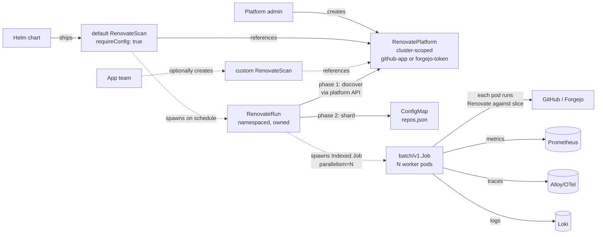

<!-- markdownlint-disable-file MD025 MD041 -->

# RFC 0001: Build a kubebuilder-based Renovate Operator

**Status:** Draft
**Author:** donaldgifford
**Date:** 2026-04-26

<!--toc:start-->
- [Summary](#summary)
- [Problem Statement](#problem-statement)
  - [The fundamental limitation: sequential repo processing](#the-fundamental-limitation-sequential-repo-processing)
  - [The two consumer profiles](#the-two-consumer-profiles)
  - [Goals (v0.1.0)](#goals-v010)
  - [Non-Goals (v0.1.0)](#non-goals-v010)
- [Why not mogenius/renovate-operator](#why-not-mogeniusrenovate-operator)
  - [1. No within-run parallelism](#1-no-within-run-parallelism)
  - [2. The RenovateJob CRD conflates everything](#2-the-renovatejob-crd-conflates-everything)
  - [3. The naming lies](#3-the-naming-lies)
  - [4. Run state is stored in the parent CRD's status](#4-run-state-is-stored-in-the-parent-crds-status)
  - [5. The scheduler is a 10-second polling loop](#5-the-scheduler-is-a-10-second-polling-loop)
  - [6. Custom string status fields instead of metav1.Condition](#6-custom-string-status-fields-instead-of-metav1condition)
  - [7. The operator binary embeds a React UI](#7-the-operator-binary-embeds-a-react-ui)
  - [8. Platform credentials are per-CRD-instance](#8-platform-credentials-are-per-crd-instance)
  - [9. The codebase is hand-written, not kubebuilder-generated](#9-the-codebase-is-hand-written-not-kubebuilder-generated)
  - [10. Vendor-coupled API group](#10-vendor-coupled-api-group)
  - [11. No path to ESO-friendly credentials, no GitHub App native flow](#11-no-path-to-eso-friendly-credentials-no-github-app-native-flow)
  - [What mogenius does well, that we copy](#what-mogenius-does-well-that-we-copy)
- [Proposed Solution](#proposed-solution)
  - [Three CRDs](#three-crds)
  - [Default Scan via Helm](#default-scan-via-helm)
  - [High-level flow](#high-level-flow)
  - [Multi-platform](#multi-platform)
  - [Observability](#observability)
- [Alternatives Considered](#alternatives-considered)
  - [A. Adopt mogenius/renovate-operator and contribute upstream](#a-adopt-mogeniusrenovate-operator-and-contribute-upstream)
  - [B. Use Mend Renovate Enterprise Edition](#b-use-mend-renovate-enterprise-edition)
  - [C. CronJob + Renovate CLI image](#c-cronjob--renovate-cli-image)
  - [D. Build on kro (Kube Resource Orchestrator)](#d-build-on-kro-kube-resource-orchestrator)
  - [E. Build on operator-sdk](#e-build-on-operator-sdk)
  - [F. Hand-orchestrate parallelism with N independent Jobs](#f-hand-orchestrate-parallelism-with-n-independent-jobs)
- [Implementation Phases](#implementation-phases)
  - [Phase 1: v0.1.0 — first complete release](#phase-1-v010--first-complete-release)
  - [Phase 2: v0.2.0 — webhooks and on-demand runs](#phase-2-v020--webhooks-and-on-demand-runs)
  - [Phase 3: v0.3.0 — additional platforms](#phase-3-v030--additional-platforms)
  - [Phase 4: v1.0.0 — API stability](#phase-4-v100--api-stability)
- [Risks and Mitigations](#risks-and-mitigations)
- [Success Criteria](#success-criteria)
- [References](#references)
<!--toc:end-->

## Summary

Build a Kubernetes operator that runs [Renovate](https://github.com/renovatebot/renovate) at any scale by **sharding repository scans across N parallel worker pods**, where N autoscales between operator-defined `minPods` and `maxPods` based on discovered repository count. The same operator handles the homelab case (~30 repos, one Forgejo + one GitHub) and the enterprise case (tens of thousands of repos across multiple GitHub orgs). Distributed via a kubebuilder-generated Helm chart that ships an opinionated default `RenovateScan` out of the box. Standard kubebuilder observability surface (Prometheus, OTel, structured logging, pprof) with `contrib/` dashboards and alerts ready to drop into a Grafana stack.

## Problem Statement

### The fundamental limitation: sequential repo processing

Self-hosted Renovate today — whether via the CLI, Mend Renovate Community Edition, or [`mogenius/renovate-operator`](https://github.com/mogenius/renovate-operator) — runs a single Renovate process that walks repositories **one at a time**. The `parallelism` knob in mogenius and similar projects controls how many *Renovate processes* run concurrently across schedules, not how repos within one run are processed. Each process is itself sequential.

This is acceptable for a small org. For 30 repos at ~10s per repo, a run finishes in about 5 minutes. For 3,000 repos that becomes 8+ hours; for 30,000 it becomes a day-plus. Beyond a certain size, "self-hosted Renovate on Kubernetes" stops being a real option and orgs are pushed toward Mend's hosted SaaS, multi-process bash glue, or doing without dependency updates.

We solve this by **sharding the discovered repository list across an Indexed Job's worker pods**, with the operator computing the parallelism factor at run time:

```
N = clamp(ceil(discovered_repos / reposPerPod), minPods, maxPods)
```

Each worker pod runs Renovate against its slice of the repo list. The same code path that handles the homelab's 30 repos with `N=1` handles the enterprise's 30,000 with `N=50`.

### The two consumer profiles

We design for two scales simultaneously, both real:

1. **Homelab** — Talos cluster, two platforms (Forgejo for personal infra, GitHub for `donaldgifford` and a couple of orgs), ~30 total repos, weekly cadence, must be cheap and observable on a single-node Prometheus + Loki + Alloy stack.
2. **Enterprise** — multiple GitHub orgs (GitHub App auth, not PAT), tens of thousands of repos, must integrate with the centralized `renovate-config` preset pattern, External Secrets Operator (ESO) for credentials, and the existing platform observability stack.

Both profiles stress different parts of the design (the homelab stresses the multi-platform path and the default-Scan ergonomics; the enterprise stresses parallelism, scheduling, and observability cardinality), and shipping both from v0.1.0 forces the design to handle both.

### Goals (v0.1.0)

- **Scale from 30 to 30,000 repos** via parallel worker sharding within a single Run.
- **Three CRDs with single-purpose semantics**: `RenovatePlatform` (cluster, platform team), `RenovateScan` (namespace, app team), `RenovateRun` (namespace, controller-owned, ephemeral). See [ADR-0003](../adr/0003-multi-crd-architecture.md).
- **Multi-platform from day one**: GitHub via GitHub App, Forgejo via token. See [ADR-0006](../adr/0006-multi-platform-support.md).
- **Default `RenovateScan` shipped via the Helm chart**, enabled by default, with `requireConfig: true` so autodiscovery only adopts repos that already have a Renovate config in their default branch. See [ADR-0008](../adr/0008-default-scan-via-helm-chart.md).
- **Standard Kubernetes status semantics**: `metav1.Condition` everywhere, `observedGeneration`, status subresource, owner references. See [ADR-0004](../adr/0004-use-conditions-and-run-children-for-status.md).
- **Full observability surface**: Prometheus metrics, OTel traces on hot paths, structured `logr`/zap logs, pprof on the operator. Plus a `contrib/` directory of Grafana dashboards, Prometheus alerts, recording rules, and Alloy/Loki configs. See [ADR-0007](../adr/0007-observability-stack.md).
- **Helm chart distribution** generated by the kubebuilder Helm plugin so chart and CRDs cannot drift. See [ADR-0002](../adr/0002-adopt-kubebuilder-helm-chart-plugin.md).
- **Full CI**: lint, unit, envtest, kind-based e2e, multi-arch image build, chart push, security scan, on every PR.

### Non-Goals (v0.1.0)

- Built-in web UI. `kubectl get renovaterun` + Grafana is the story.
- Webhook-triggered runs. Schedule-driven only in v0.1.0; webhook receiver is post-v0.1.0.
- GitLab, Bitbucket, Azure DevOps. Additive in later releases; not required for the homelab/enterprise mix.
- API stability. v1alpha1 group; breaking changes allowed until v1beta1.
- Multi-cluster fleet management. Use ArgoCD ApplicationSets or similar to fan out across clusters.
- pprof on Renovate workers themselves (Renovate is Node.js; the operator's pprof story doesn't extend there). Operator pprof only.

## Why not `mogenius/renovate-operator`

The mogenius operator is the obvious "just adopt what exists" answer. We rejected it after reading the source. Specific objections, in roughly descending importance:

### 1. No within-run parallelism

The headline reason. `spec.parallelism` controls how many independent Renovate *processes* run side-by-side across distinct schedules; within a single Renovate process, repositories are still walked sequentially. A 30,000-repo org runs one repo at a time, full stop. This is the problem we're building this operator to solve, and it is structural to mogenius's design — not a config knob you can flip.

### 2. The `RenovateJob` CRD conflates everything

A single CRD models the schedule, the parallelism budget, the discovery filter, the platform credentials, pod scheduling rules (`affinity`, `tolerations`, `extraVolumes`, `extraEnv`), and the per-project execution state. The generated CRD YAML is north of 1100 lines. This means:

- A change to platform credentials forces a `kubectl apply` against the same object that holds run history.
- RBAC cannot split between "platform team owns endpoints/auth" and "app team owns scan policy."
- The schema is unreadable at a glance — a fundamental violation of "the CRD is the API."

### 3. The naming lies

`RenovateJob` is not a job. It is a long-lived schedule + state machine + project list. A real `Job` is a one-shot. New users see `kubectl get renovatejob` and reasonably expect ephemeral execution semantics; they get a continuously-mutating singleton with array-of-projects in `.status`.

### 4. Run state is stored in the parent CRD's status

The list of discovered projects, plus each project's status (`Scheduled`/`Running`/`Failed`/`Succeeded`), lives in `.status.projects[]` on the parent. This means:

- Status writes are write-amplified — every project transition rewrites the whole status array.
- `kubectl get` on a single run requires JSON-path filtering instead of `kubectl get renovaterun -l scan=foo`.
- There is no per-run TTL, no per-run `kubectl describe`, no per-run owner reference, no `kubectl logs` shortcut.
- Audit trails are awkward — historical runs are kept in `.status.history[]` rather than as enumerable resources.

### 5. The scheduler is a 10-second polling loop

> "Every 10 seconds the operator checks for scheduled projects and starts a new renovate job"

This is a busy loop hard-coded into the controller. Standard kubebuilder reconciliation uses informers + workqueues + `RequeueAfter` for time-based triggers. The polling design also means the operator must hold an internal mutex for scheduler correctness, which leader election should handle for free.

### 6. Custom string status fields instead of `metav1.Condition`

The CRD uses bare string enums (`"Scheduled"`, `"Running"`, `"Failed"`, `"Succeeded"`). The Kubernetes convention since 1.19+ is `[]metav1.Condition`, which gives:

- Standard `Type` / `Status` / `Reason` / `Message` / `LastTransitionTime` / `ObservedGeneration` fields.
- `kubectl wait --for=condition=Ready` semantics for free.
- Interop with `kstatus`, ArgoCD's health framework, and Flux's readiness checks.

### 7. The operator binary embeds a React UI

A React dashboard runs on port 8081 inside the operator pod. This inflates the binary, couples UI release cadence to controller release cadence, increases the controller's blast radius (the same RBAC service account serves the UI), and forces deployers who don't want the UI to either tolerate it or fork. A separate `renovate-dashboard` Deployment that watches CRDs is the right shape if/when this is needed.

### 8. Platform credentials are per-CRD-instance

Every `RenovateJob` carries its own `secretRef` for platform credentials. In an enterprise setup with 50+ scans pointing at the same GitHub org, this means 50+ secret references to rotate when a token cycles. A cluster-scoped `RenovatePlatform` resource that scans reference centralizes this.

### 9. The codebase is hand-written, not kubebuilder-generated

The repo lacks the standard kubebuilder layout. Reading reconciliation code requires re-learning the project's bespoke organization. For a 7-person platform team that already maintains other kubebuilder operators (`repo-guardian`, the Wiz operator), familiarity has compounding value.

### 10. Vendor-coupled API group

The API group is `mogenius.com/v1alpha1`. Forking and rebranding for enterprise consumption means changing the group, which is a breaking change for any GitOps repos that already use the upstream group.

### 11. No path to ESO-friendly credentials, no GitHub App native flow

GitHub App support is documented as "we are still working on that." Our enterprise stack already runs External Secrets Operator pulling from AWS Secrets Manager / Parameter Store; we need the operator to consume k8s `Secret` objects that ESO populates, with first-class GitHub App auth. v0.1.0 ships GitHub App support directly.

### What mogenius does well, that we copy

- The user-facing concept of "set a schedule, let autodiscovery find repos, run Renovate against them" is correct.
- Helm chart distribution via OCI registry is the right delivery model.
- Per-platform feature parity (GitHub, GitLab, Forgejo, Gitea, Bitbucket, ADO) is the right direction even if v0.1.0 only does two.
- Prometheus metrics are non-negotiable.

We borrow these ideas; we reject the implementation shape.

## Proposed Solution

### Three CRDs

| Kind | Scope | Owner | Concern |
|------|-------|-------|---------|
| `RenovatePlatform` | Cluster | Platform team | Platform endpoint, auth (GitHub App or token), runner-level config (`config.js` equivalent), preset repo reference |
| `RenovateScan` | Namespace | App team | Schedule, discovery filter, parallelism bounds, scan-level config overrides |
| `RenovateRun` | Namespace | Controller (owned by Scan) | A single sharded execution; owns one Indexed `batch/v1.Job` |

The `RenovateScan` controller spawns `RenovateRun` children on its schedule. The `RenovateRun` controller runs a two-phase lifecycle: **discover** (enumerate matching repos via the platform API, filter by `requireConfig`), then **shard** (compute N from `minPods`/`maxPods`/`reposPerPod` and launch an Indexed Job with `parallelism=N`). Each worker pod reads its slice of the repo list from a ConfigMap and runs Renovate against it.

See [ADR-0003](../adr/0003-multi-crd-architecture.md) for the CRD partition decision and [ADR-0005](../adr/0005-indexed-jobs-for-parallelism.md) for the parallelism approach.

### Default Scan via Helm

The Helm chart ships a `RenovateScan` named `default` (in the operator's release namespace), enabled by default in `values.yaml`. Its discovery is set to `autodiscover: true` with `requireConfig: true` — autodiscovery only adopts repos that have a Renovate config file in their default branch. This is the v0.1.0 zero-config experience: install the chart, create a `RenovatePlatform`, and any repo in the org with a `renovate.json` is picked up on the next weekly run.

See [ADR-0008](../adr/0008-default-scan-via-helm-chart.md).

### High-level flow



### Multi-platform

`RenovatePlatform.spec.platformType` is a discriminator over `github | forgejo` for v0.1.0. `spec.auth` is a discriminated union — `auth.githubApp` (with `appID` + `privateKeyRef` + optional `installationID`) for GitHub, `auth.token` (with `secretRef`) for Forgejo. CEL validation on the CRD enforces shape consistency.

See [ADR-0006](../adr/0006-multi-platform-support.md).

### Observability

- **Logs**: structured JSON via `logr` backed by zap (kubebuilder default). Standard fields plus domain-specific `platform`/`scan`/`run`/`repo`. Loki-friendly.
- **Metrics**: controller-runtime defaults plus custom `renovate_*` metrics for run duration, repos discovered, repos processed by status, workers active, PRs opened.
- **Traces**: OTel SDK, hot-path spans (reconcile, discovery, shard assignment), exported to a configurable OTLP endpoint (Alloy in our setup, but vendor-neutral).
- **Profiling**: `net/http/pprof` on a dedicated port behind a flag.
- **`contrib/`**: ready-to-import Grafana dashboards, PrometheusRule alerts/recording rules, Alloy config snippets.

See [ADR-0007](../adr/0007-observability-stack.md).

## Alternatives Considered

### A. Adopt `mogenius/renovate-operator` and contribute upstream

The cheapest path on day one. Rejected because the architectural objections above are not bug-fixes — they are foundational design choices. The most important one — sequential within-run processing — would require a redesign of their `RenovateJob` reconciler that they have no incentive to accept. We'd be carrying a fork forever. We also hit two more pragmatic concerns: their API group is vendor-coupled, and their CRD shape blocks the RBAC model we want.

### B. Use Mend Renovate Enterprise Edition

Considered separately for enterprise procurement. Even if adopted at the enterprise, it does not give us the homelab story, the GitOps-as-CRD ergonomics, integration with our internal `repo-guardian` and ESO patterns, or the parallel-sharding model. Not mutually exclusive with this RFC.

### C. CronJob + Renovate CLI image

The simplest possible thing. Works for one repo per CronJob, falls over hard at 30+ repos because we'd be reinventing scheduling, parallelism, discovery filtering, status tracking, and observability in YAML. This RFC exists precisely to escape this option.

### D. Build on `kro` (Kube Resource Orchestrator)

`kro` is a good fit for "compose existing primitives into a higher-level abstraction" but a poor fit when you need a stateful controller with reconciliation logic (scheduling, run history, condition transitions, parallelism orchestration). Renovate-operator falls squarely into the latter bucket.

### E. Build on `operator-sdk`

Operator-sdk Go-mode is a thin wrapper over kubebuilder. We pick kubebuilder directly to skip the layer. See [ADR-0001](../adr/0001-use-kubebuilder-for-operator-scaffolding.md).

### F. Hand-orchestrate parallelism with N independent Jobs

Instead of one Indexed Job with `parallelism=N`, the controller could spawn N independent Jobs and manage them as a pool. More controller code, more dynamic resizing within a Run, but Indexed Jobs do almost everything we want for free (completion accounting, parallelism cap, retry semantics, owner references). See [ADR-0005](../adr/0005-indexed-jobs-for-parallelism.md) for the comparison.

## Implementation Phases

### Phase 1: v0.1.0 — first complete release

Scope:

- All three CRDs: `RenovatePlatform`, `RenovateScan`, `RenovateRun`.
- Two platforms: GitHub via GitHub App, Forgejo via token.
- Indexed-Job parallelism with `minPods`/`maxPods`/`reposPerPod` autoscaling.
- Default `RenovateScan` shipped via Helm with `requireConfig: true`.
- Helm chart generated by kubebuilder Helm plugin, published to OCI.
- Multi-arch (`amd64`, `arm64`) container images.
- Full observability: Prometheus metrics, OTel traces, structured logs, pprof.
- `contrib/` directory: Grafana dashboards, Prometheus alerts, recording rules, Alloy config.
- Full CI: lint (`golangci-lint`), unit tests, envtest controller tests, kind-based e2e, image build, chart publish, security scan (`trivy`), CRD schema regression check.
- Documentation: README, install guide, platform setup guides for GitHub App and Forgejo, observability quickstart.

Detailed in [DESIGN-0001](../design/0001-renovate-operator-v0-1-0.md).

### Phase 2: v0.2.0 — webhooks and on-demand runs

Webhook receiver as a separate Deployment in the chart (off by default). Inbound platform webhooks (GitHub `push` events, Forgejo equivalents) trigger an out-of-band `RenovateRun` against a single repo, bypassing the schedule. Useful for "I just merged a base config update; run Renovate now" flows.

### Phase 3: v0.3.0 — additional platforms

GitLab, Bitbucket Server, Azure DevOps. Each is mostly auth glue plus env var assembly for the worker; the parallelism and scheduling code is unchanged.

### Phase 4: v1.0.0 — API stability

Graduate `v1alpha1` → `v1beta1` → `v1` with conversion webhooks and deprecation policy. Backward-compat tests in CI.

Out of scope for the foreseeable future: built-in UI (use the `contrib/` Grafana dashboards), multi-cluster fleet management (use ArgoCD ApplicationSets), bin-packing scheduler that places repos on workers by historical run time (a v1.x research item).

## Risks and Mitigations

| Risk | Impact | Likelihood | Mitigation |
|------|--------|------------|------------|
| Renovate CLI behavior changes break the operator's expectations of its output (especially logs we parse for PR counts) | Medium | Medium | Pin Renovate image tag in `RenovatePlatform.spec.renovateImage`; integration test against the pinned tag in CI; log parsing behind a feature flag with a fallback |
| Indexed-Job sharding produces stragglers — one pod gets a shard with several slow repos | Medium | High | Sort discovered repos by historical run time when available; in v0.1.0 use a stable hash to randomize shard assignment so slow repos are distributed; revisit with a real bin-packer in v1.x |
| GitHub App rate limits when discovering 30k repos | High | Medium | Discovery uses GraphQL where possible; cache discovery output in the Run's ConfigMap; expose backoff config; document expected request volumes |
| OTel and Prometheus cardinality blowup at enterprise scale (30k repos × labels) | High | High | Per-repo metrics gated by a feature flag (default off); aggregate metrics by platform/scan only by default; document cardinality cost in the observability guide |
| API churn during v0.x makes adopters' GitOps repos painful | Medium | High | Explicit `v1alpha1` group versioning, no compatibility promises until v1beta1, document migration steps |
| Maintaining a project alone is unsustainable; bus factor of 1 | High | Medium | kubebuilder scaffolding keeps the codebase familiar; design docs (this folder) onboard new contributors; `contrib/` lowers the barrier for users to operate it without code changes |
| Per-Scan default in Helm conflicts with GitOps users who want to manage Scans themselves | Low | Medium | Default Scan is opt-out via `defaultScan.enabled=false` in `values.yaml`; documented prominently |

## Success Criteria

- v0.1.0 deployable to the homelab Talos cluster via `helm install` and successfully runs Renovate against both `donaldgifford/*` (GitHub) and the homelab Forgejo instance, end-to-end, on its weekly schedule.
- A run against a 30-repo set completes in under 10 minutes wall-clock with `maxPods=5`.
- A synthetic 1,000-repo set (against a stub platform in CI) completes in linear time as `maxPods` increases — i.e., 5x parallelism roughly halves wall-clock vs `maxPods=1`, modulo discovery overhead.
- Every status transition is observable via `metav1.Condition`, `kubectl describe`, Prometheus, OTel traces, and Loki logs without code changes.
- A platform engineer who has never seen the project can locate the reconciliation entrypoint in under 60 seconds (kubebuilder convention: `internal/controller/<kind>_controller.go`).
- Importing `contrib/grafana/dashboards/operator-overview.json` against a fresh Grafana instance produces a populated dashboard immediately on the first Run.
- The CRD YAML for each kind, when rendered by `kubebuilder`, fits in under 400 lines.

## References

- [renovatebot/renovate](https://github.com/renovatebot/renovate)
- [`mogenius/renovate-operator`](https://github.com/mogenius/renovate-operator) — what we are not building
- [kubebuilder book](https://book.kubebuilder.io/)
- [kubebuilder Helm plugin (alpha)](https://book.kubebuilder.io/plugins/available/helm-v1-alpha)
- [Indexed Job (Kubernetes batch/v1)](https://kubernetes.io/docs/concepts/workloads/controllers/job/#completion-mode)
- [OpenTelemetry Go SDK](https://pkg.go.dev/go.opentelemetry.io/otel)
- [Grafana Alloy](https://grafana.com/docs/alloy/latest/)
- [Kubernetes API conventions: condition types](https://github.com/kubernetes/community/blob/master/contributors/devel/sig-architecture/api-conventions.md#typical-status-properties)
- ADR-0001: Use kubebuilder for operator scaffolding
- ADR-0002: Adopt the kubebuilder Helm chart plugin
- ADR-0003: Multi-CRD architecture
- ADR-0004: Use `metav1.Condition` and Run child resources for status
- ADR-0005: Use Indexed Jobs for parallel Run workers
- ADR-0006: Multi-platform support (GitHub App + Forgejo)
- ADR-0007: Observability stack
- ADR-0008: Default `RenovateScan` shipped via Helm chart
- DESIGN-0001: renovate-operator v0.1.0
